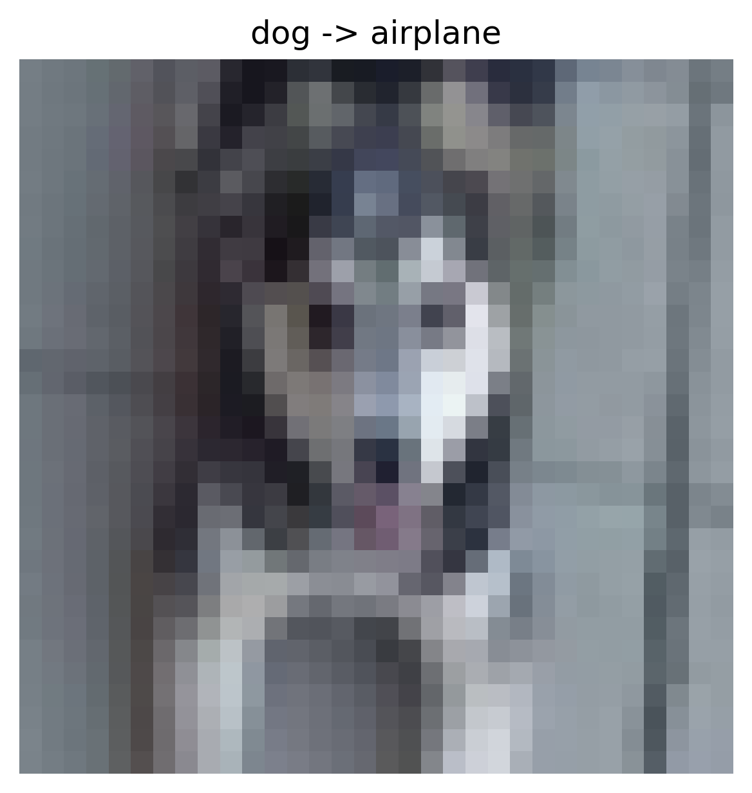
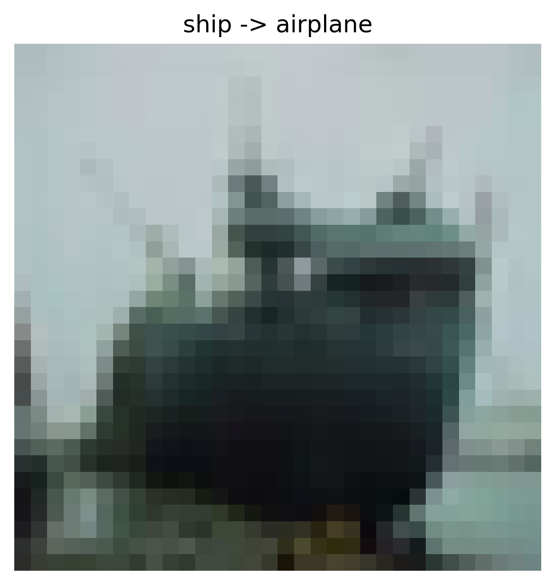
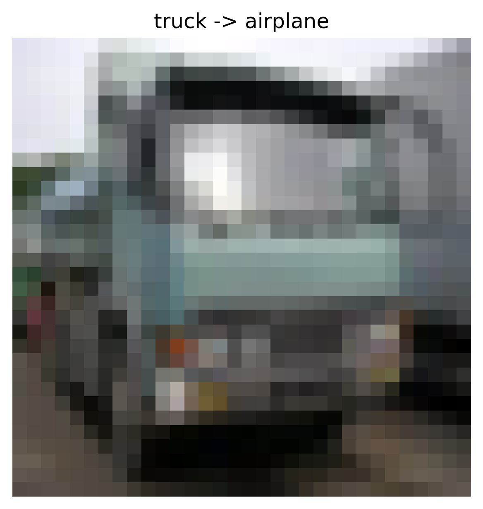
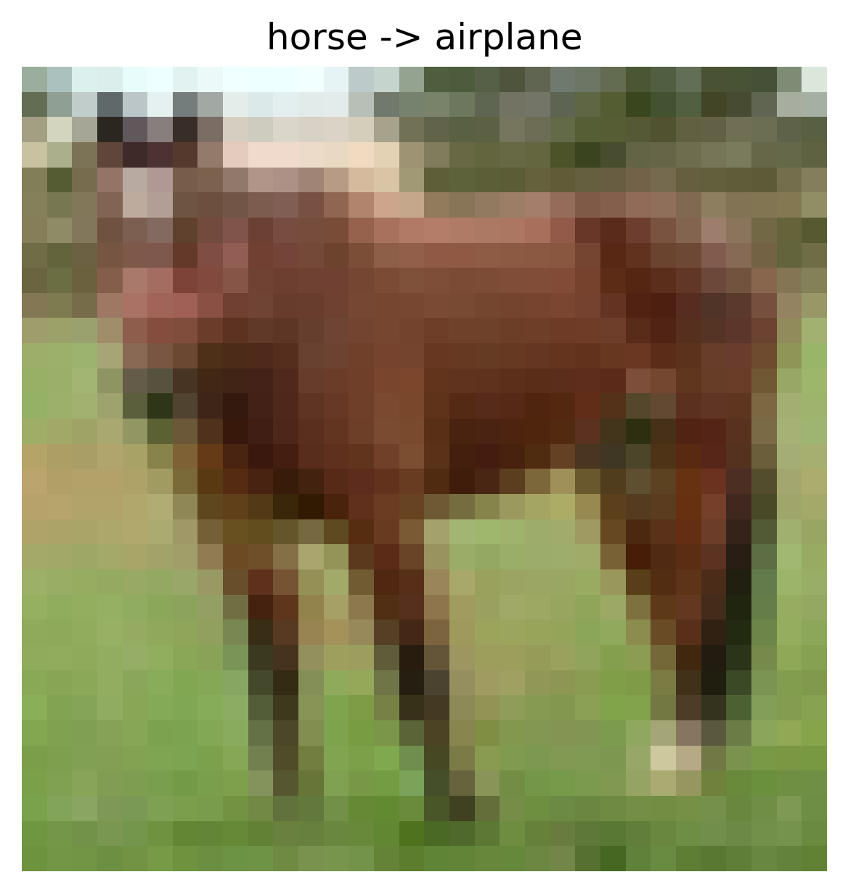
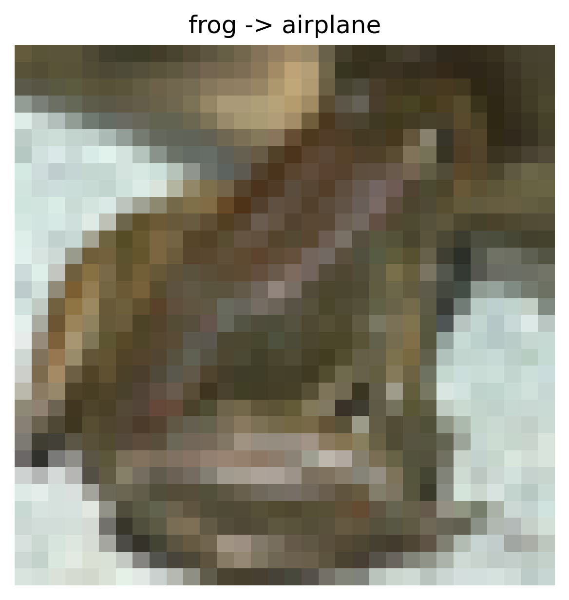

# Data Poisoning Attack Report

## Overview

- **Attack Type:** label_flipping
- **Strategy:** many_to_one
- **Flip Rate:** 0.15
- **Target Class:** 0
- **Source Classes:** All except target
- **Number of Flipped Samples:** 6069

## Performance Metrics

- **Accuracy After Attack:** 0.7037

## Flip Summary

| Original -> New | Count |
|------------------|--------|
| dog->airplane | 677 |
| ship->airplane | 666 |
| truck->airplane | 664 |
| horse->airplane | 645 |
| frog->airplane | 711 |
| bird->airplane | 650 |
| automobile->airplane | 659 |
| cat->airplane | 699 |
| deer->airplane | 698 |

## Example Flips

| Index | Original Label | New Label |
|--------|----------------|-----------|
| 41141 | dog | airplane |
| 37565 | ship | airplane |
| 35331 | truck | airplane |
| 8311 | horse | airplane |
| 10946 | frog | airplane |

## Visual Flip Examples (first 5)

<small><strong>dog -> airplane</strong></small> 

<small><strong>ship -> airplane</strong></small> 

<small><strong>truck -> airplane</strong></small> 

<small><strong>horse -> airplane</strong></small> 

<small><strong>frog -> airplane</strong></small> 

