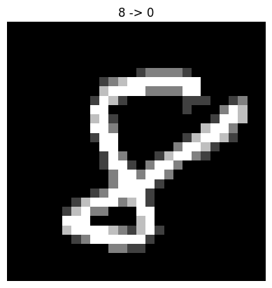
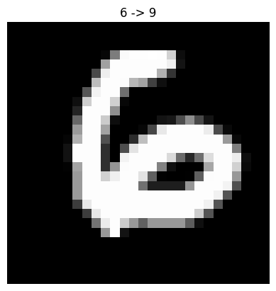
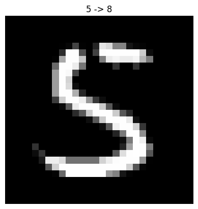
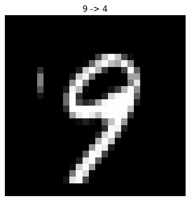
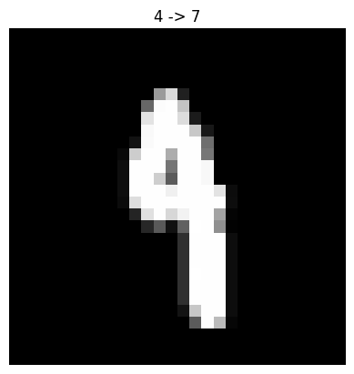

# Data Poisoning Attack Report

## Overview

- **Attack Type:** label_flipping
- **Flip Rate:** 0.08
- **Targeted Attack:** No (untargeted)
- **Number of Flipped Samples:** 4320

## Performance Metrics

- **Accuracy After Attack:** 0.9875

## Flip Summary

| Original -> New | Count |
|-----------------|-------|
| 8->0 | 51 |
| 6->9 | 51 |
| 5->8 | 44 |
| 9->4 | 35 |
| 4->7 | 40 |
| 2->8 | 62 |
| 6->3 | 46 |
| 5->4 | 41 |
| 1->7 | 56 |
| 7->6 | 48 |
| 9->7 | 48 |
| 0->8 | 48 |
| 8->4 | 53 |
| 6->0 | 43 |
| 0->3 | 45 |
| 7->9 | 40 |
| 6->1 | 47 |
| 4->0 | 55 |
| 0->6 | 50 |
| 3->4 | 53 |
| 6->5 | 60 |
| 8->9 | 39 |
| 3->7 | 45 |
| 0->2 | 43 |
| 7->4 | 61 |
| 6->8 | 48 |
| 3->2 | 52 |
| 8->3 | 55 |
| 3->0 | 43 |
| 9->6 | 41 |
| 7->0 | 51 |
| 1->4 | 60 |
| 0->5 | 47 |
| 3->5 | 55 |
| 6->2 | 48 |
| 0->9 | 46 |
| 1->0 | 55 |
| 4->3 | 49 |
| 7->5 | 63 |
| 9->5 | 42 |
| 2->6 | 47 |
| 8->6 | 52 |
| 2->7 | 54 |
| 2->1 | 53 |
| 2->4 | 59 |
| 7->1 | 42 |
| 3->9 | 54 |
| 1->3 | 49 |
| 0->4 | 44 |
| 1->9 | 43 |
| 9->0 | 54 |
| 4->1 | 64 |
| 5->7 | 49 |
| 4->9 | 50 |
| 3->6 | 37 |
| 8->7 | 46 |
| 1->2 | 52 |
| 4->2 | 55 |
| 3->1 | 48 |
| 6->7 | 33 |
| 7->2 | 60 |
| 4->8 | 49 |
| 5->6 | 38 |
| 8->2 | 38 |
| 5->1 | 35 |
| 2->3 | 43 |
| 5->2 | 44 |
| 5->0 | 49 |
| 9->2 | 60 |
| 1->5 | 53 |
| 8->1 | 45 |
| 2->5 | 42 |
| 8->5 | 50 |
| 4->6 | 47 |
| 7->3 | 48 |
| 4->5 | 41 |
| 5->9 | 49 |
| 9->1 | 39 |
| 0->1 | 39 |
| 0->7 | 41 |
| 7->8 | 43 |
| 3->8 | 45 |
| 9->3 | 53 |
| 1->8 | 59 |
| 5->3 | 46 |
| 9->8 | 37 |
| 2->0 | 52 |
| 6->4 | 43 |
| 1->6 | 47 |
| 2->9 | 41 |

## Example Flips

| Index | Original Label | New Label |
|--------|----------------|-----------|
| 17515 | 8 | 0 |
| 58382 | 6 | 9 |
| 42511 | 5 | 8 |
| 1169 | 9 | 4 |
| 38052 | 4 | 7 |
| 34680 | 2 | 8 |
| 14634 | 6 | 3 |
| 8734 | 5 | 4 |
| 46542 | 1 | 7 |
| 9263 | 7 | 6 |

## Visual Flip Examples (first 5)

