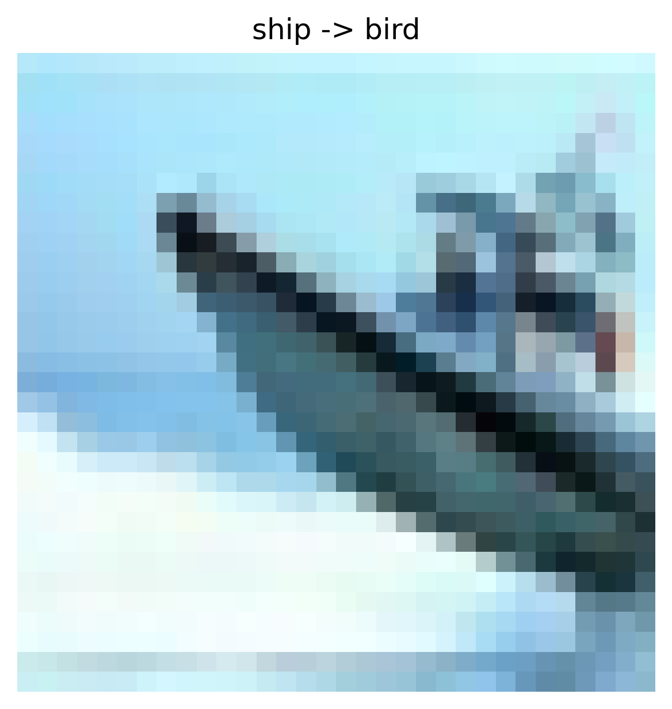
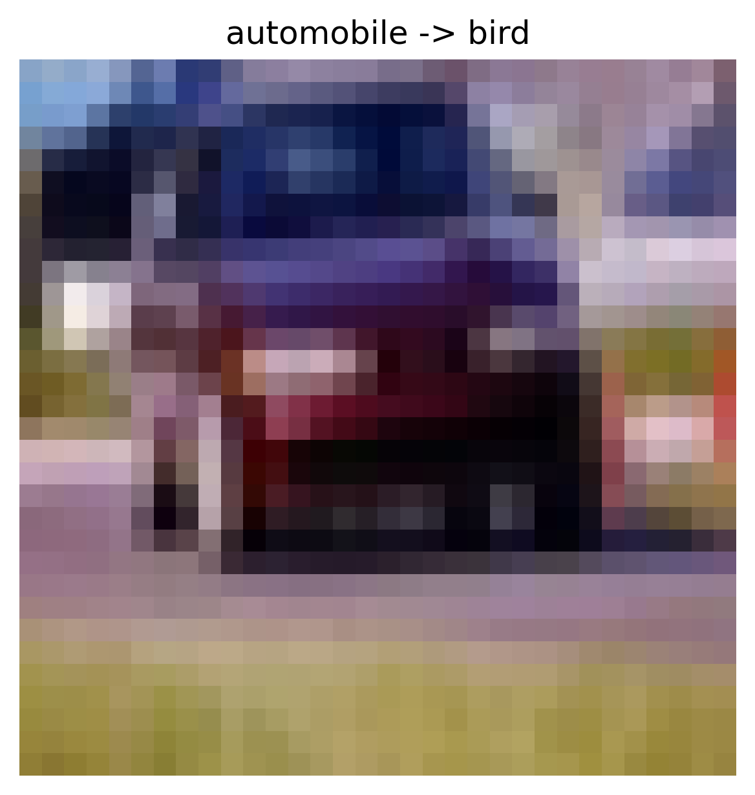
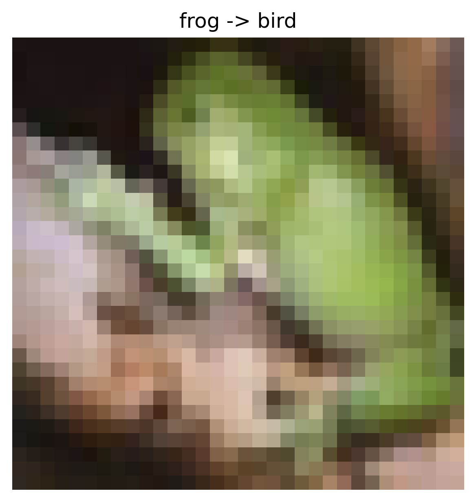
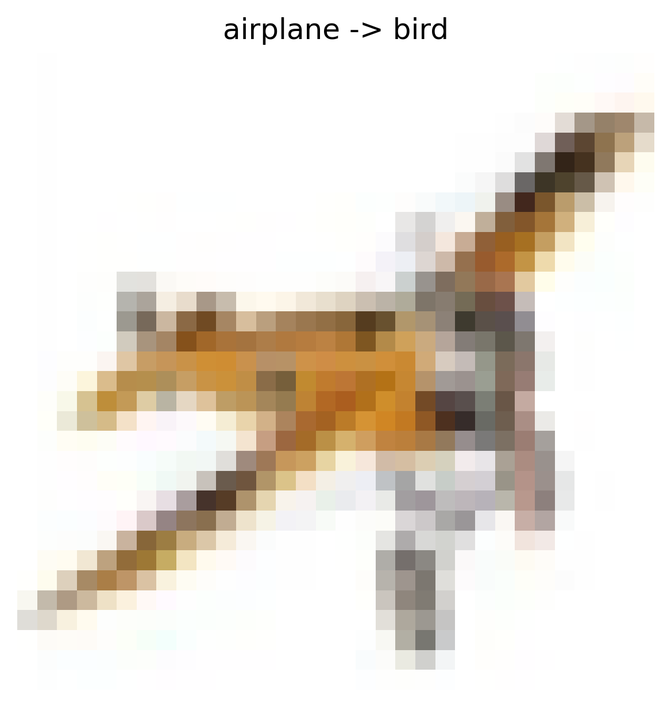
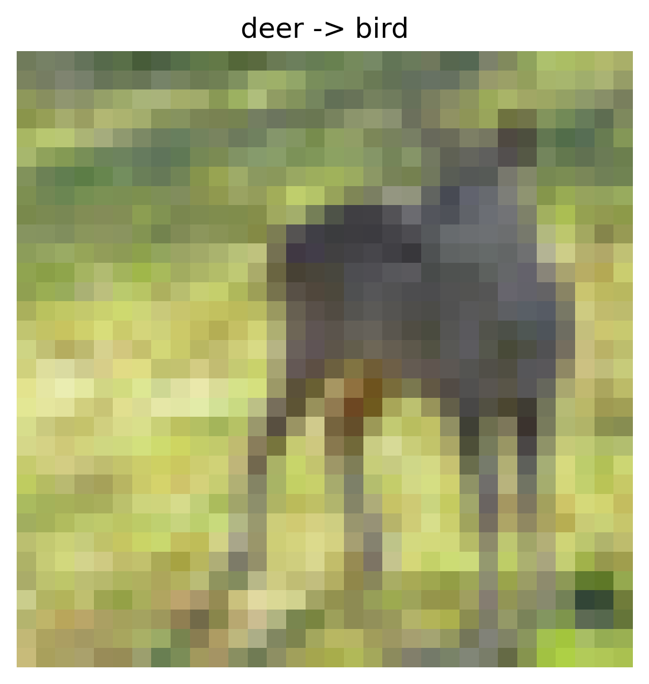

# Data Poisoning Attack Report

## Overview

- **Attack Type:** label_flipping
- **Strategy:** many_to_one
- **Flip Rate:** 0.1
- **Target Class:** 2
- **Source Classes:** All except target
- **Number of Flipped Samples:** 4045

## Performance Metrics

- **Accuracy After Attack:** 0.5721

### Per-Class Accuracy

| Class | Accuracy |
|--------|----------|
| airplane | 0.4600 |
| automobile | 0.7090 |
| bird | 0.3750 |
| cat | 0.2620 |
| deer | 0.5020 |
| dog | 0.5830 |
| frog | 0.6930 |
| horse | 0.7460 |
| ship | 0.7930 |
| truck | 0.5980 |

## Flip Summary

| Original -> New | Count |
|------------------|--------|
| ship->bird | 431 |
| automobile->bird | 468 |
| frog->bird | 432 |
| airplane->bird | 446 |
| deer->bird | 482 |
| cat->bird | 431 |
| truck->bird | 460 |
| horse->bird | 437 |
| dog->bird | 458 |

## Example Flips

| Index | Original Label | New Label |
|--------|----------------|-----------|
| 29078 | ship | bird |
| 29616 | automobile | bird |
| 5882 | frog | bird |
| 37191 | airplane | bird |
| 24221 | deer | bird |

## Visual Flip Examples (first 5)

<small><strong>ship -> bird</strong></small> 

<small><strong>automobile -> bird</strong></small> 

<small><strong>frog -> bird</strong></small> 

<small><strong>airplane -> bird</strong></small> 

<small><strong>deer -> bird</strong></small> 

