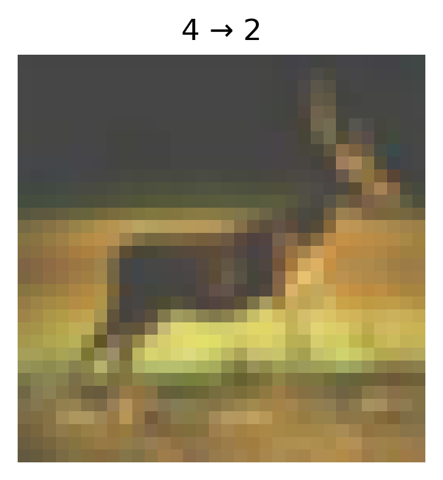
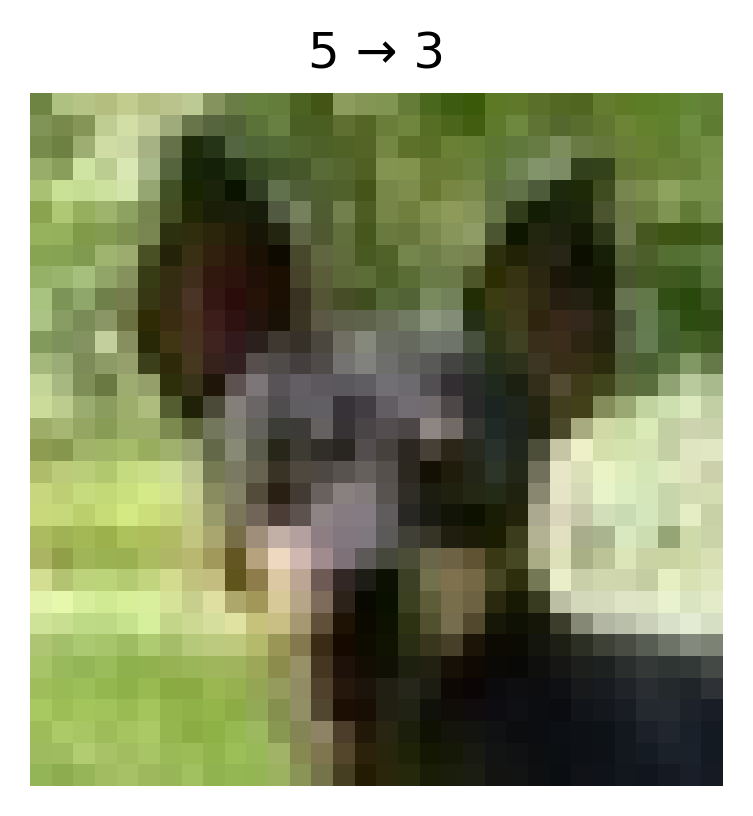
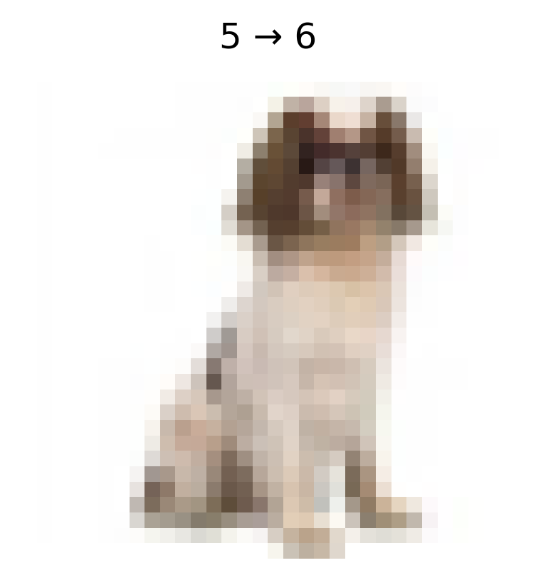
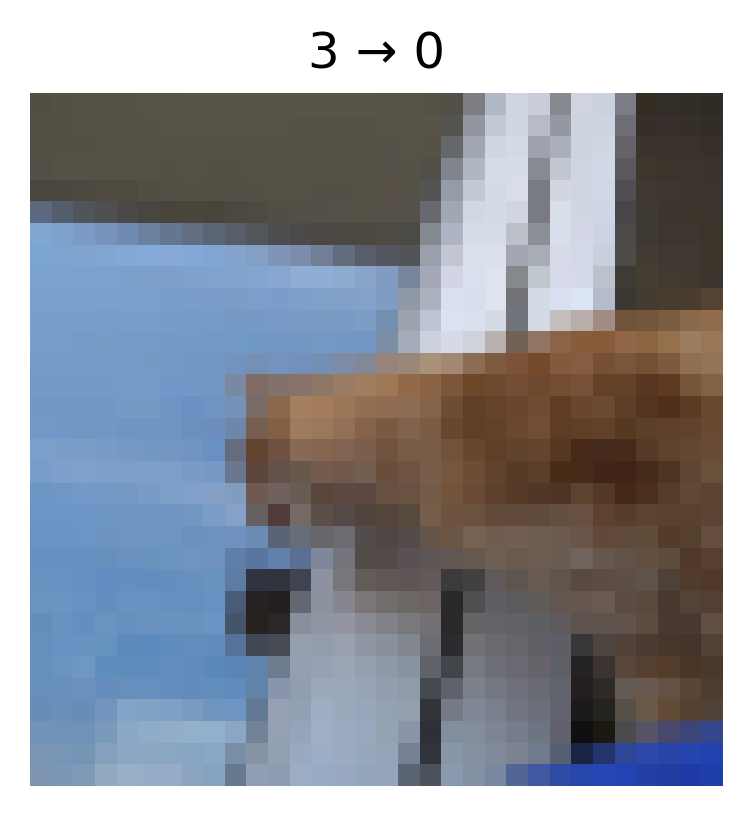
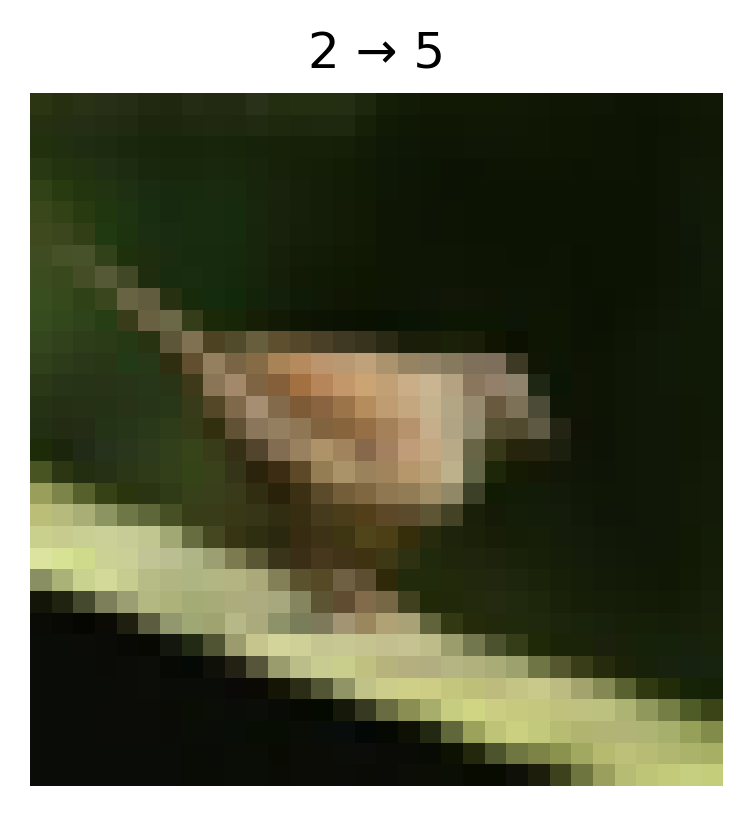

# Data Poisoning Attack Report

## Overview

- **Attack Type:** label_flipping
- **Strategy:** fully_random
- **Flip Rate:** 0.08
- **Target Class:** None
- **Source Classes:** All except target
- **Number of Flipped Samples:** 3600

## Performance Metrics

- **Accuracy After Attack:** 0.5775

## Flip Summary

| Original -> New | Count |
|------------------|--------|
| 4->2 | 34 |
| 5->3 | 43 |
| 5->6 | 43 |
| 3->0 | 31 |
| 2->5 | 42 |
| 1->0 | 39 |
| 2->8 | 41 |
| 8->2 | 45 |
| 3->5 | 47 |
| 0->9 | 49 |
| 9->1 | 34 |
| 9->7 | 30 |
| 7->8 | 38 |
| 7->2 | 33 |
| 5->1 | 34 |
| 6->2 | 43 |
| 7->3 | 43 |
| 0->6 | 40 |
| 9->5 | 46 |
| 5->4 | 48 |
| 1->3 | 39 |
| 6->4 | 28 |
| 4->5 | 47 |
| 6->8 | 42 |
| 5->0 | 49 |
| 8->7 | 38 |
| 3->2 | 43 |
| 0->1 | 37 |
| 7->1 | 39 |
| 6->5 | 46 |
| 7->9 | 43 |
| 9->0 | 28 |
| 3->6 | 30 |
| 3->9 | 34 |
| 5->7 | 41 |
| 4->6 | 48 |
| 2->0 | 44 |
| 8->4 | 38 |
| 1->8 | 41 |
| 4->0 | 34 |
| 4->7 | 42 |
| 5->9 | 42 |
| 1->4 | 43 |
| 6->9 | 38 |
| 3->4 | 45 |
| 7->5 | 48 |
| 4->8 | 40 |
| 8->5 | 33 |
| 3->7 | 41 |
| 4->3 | 39 |
| 2->1 | 36 |
| 9->8 | 51 |
| 9->4 | 43 |
| 1->5 | 33 |
| 1->6 | 30 |
| 6->0 | 41 |
| 4->9 | 47 |
| 1->2 | 48 |
| 2->9 | 43 |
| 7->0 | 59 |
| 0->2 | 33 |
| 1->9 | 45 |
| 9->2 | 43 |
| 8->0 | 37 |
| 2->7 | 46 |
| 0->8 | 39 |
| 6->1 | 43 |
| 0->4 | 50 |
| 2->3 | 60 |
| 4->1 | 41 |
| 9->6 | 40 |
| 6->3 | 43 |
| 1->7 | 48 |
| 7->6 | 37 |
| 3->1 | 27 |
| 8->3 | 31 |
| 7->4 | 39 |
| 3->8 | 35 |
| 0->3 | 35 |
| 2->6 | 42 |
| 2->4 | 41 |
| 5->8 | 42 |
| 8->9 | 38 |
| 8->6 | 35 |
| 0->7 | 28 |
| 9->3 | 33 |
| 6->7 | 39 |
| 8->1 | 25 |
| 5->2 | 35 |
| 0->5 | 36 |

## Example Flips

| Index | Original Label | New Label |
|--------|----------------|-----------|
| 49898 | deer | bird |
| 2500 | dog | cat |
| 20348 | dog | frog |
| 24518 | cat | airplane |
| 3462 | bird | dog |
| 25050 | automobile | airplane |
| 27549 | bird | ship |
| 37147 | ship | bird |
| 3242 | cat | dog |
| 14275 | airplane | truck |

## Visual Flip Examples (first 5)

**deer -> bird**

**dog -> cat**

**dog -> frog**

**cat -> airplane**

**bird -> dog**

