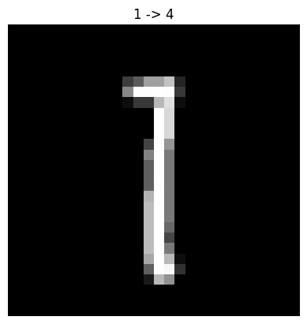
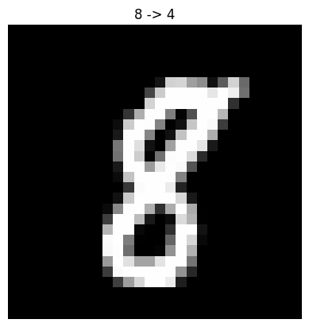
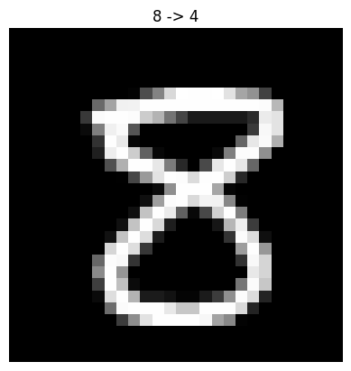
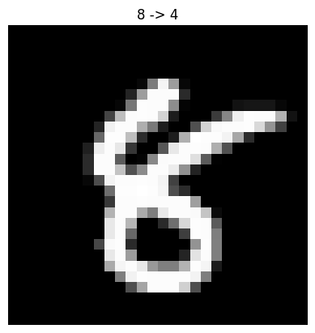
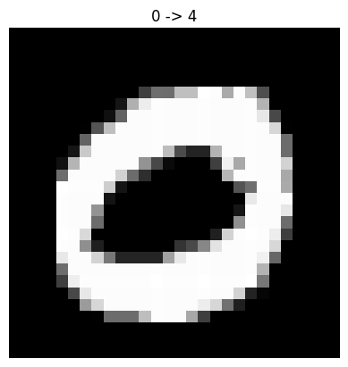

# Data Poisoning Attack Report

## Overview

- **Attack Type:** label_flipping
- **Flip Rate:** 0.08
- **Targeted Attack:** No (untargeted)
- **Number of Flipped Samples:** 3898

## Performance Metrics

- **Accuracy After Attack:** 0.9851

## Flip Summary

| Original -> New | Count |
|-----------------|-------|
| 1->4 | 445 |
| 8->4 | 403 |
| 0->4 | 409 |
| 9->4 | 439 |
| 7->4 | 458 |
| 6->4 | 445 |
| 2->4 | 441 |
| 3->4 | 450 |
| 5->4 | 408 |

## Example Flips

| Index | Original Label | New Label |
|--------|----------------|-----------|
| 23660 | 1 | 4 |
| 46614 | 8 | 4 |
| 5418 | 8 | 4 |
| 758 | 8 | 4 |
| 54391 | 0 | 4 |
| 15360 | 9 | 4 |
| 4225 | 1 | 4 |
| 34454 | 7 | 4 |
| 18903 | 6 | 4 |
| 44851 | 9 | 4 |

## Visual Flip Examples (first 5)

