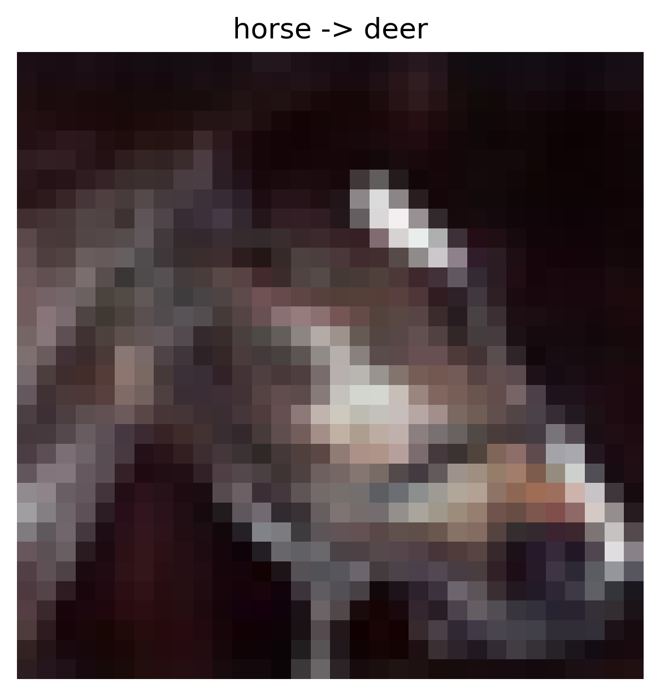
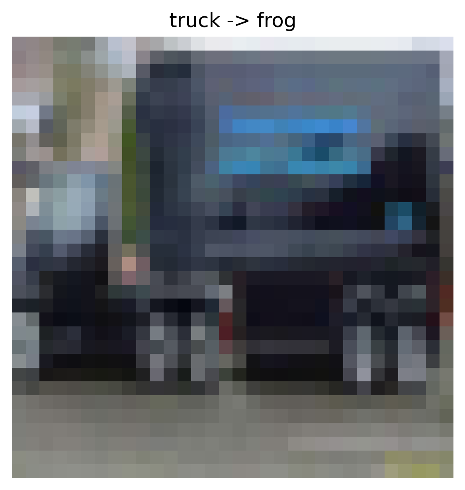
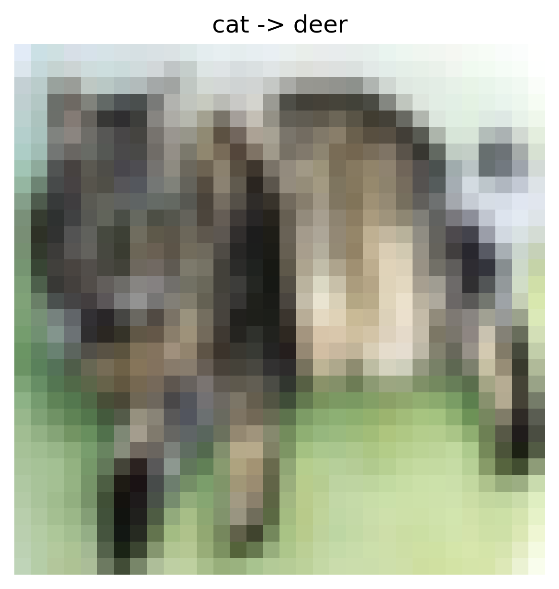
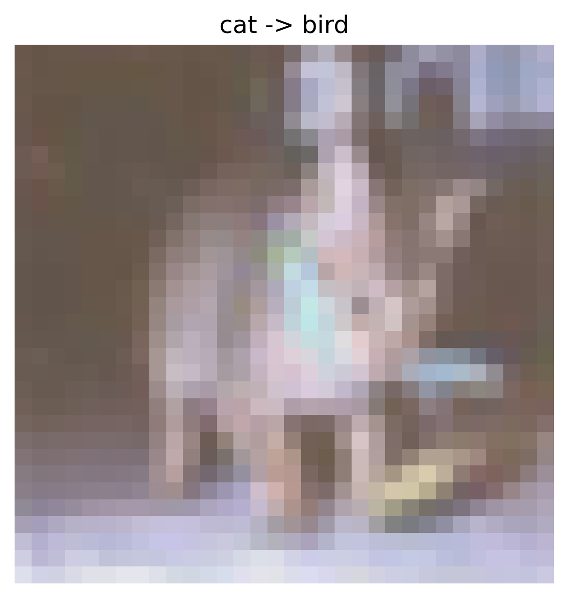
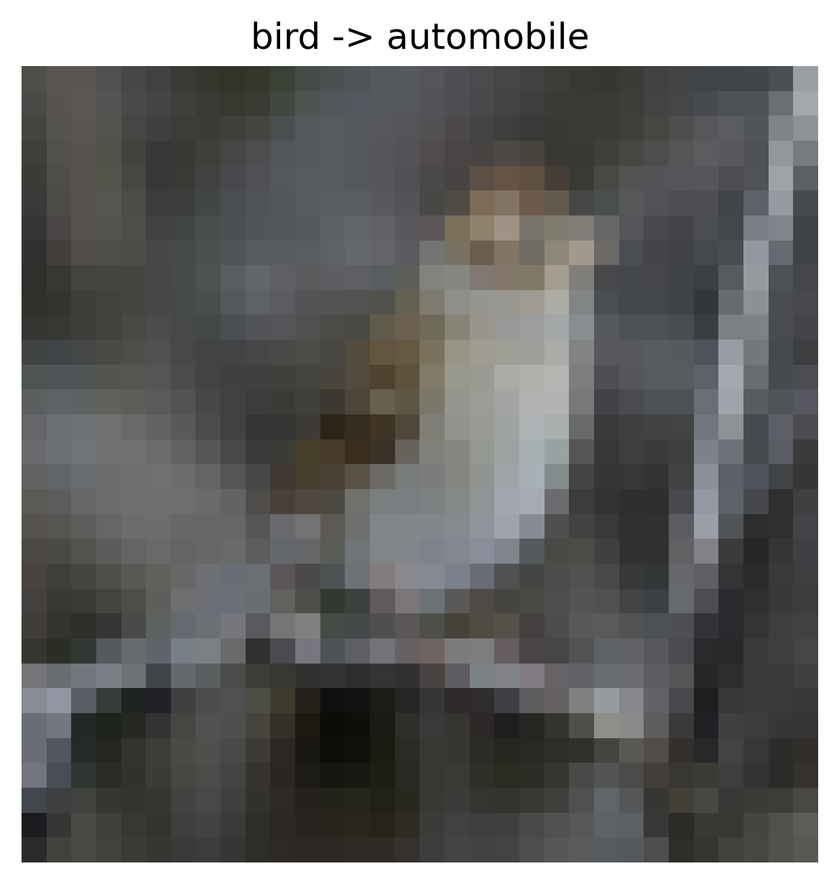

# Data Poisoning Attack Report

## Overview

- **Attack Type:** label_flipping
- **Strategy:** fully_random
- **Flip Rate:** 0.08
- **Target Class:** None
- **Source Classes:** All except target
- **Number of Flipped Samples:** 3600

## Performance Metrics

- **Accuracy After Attack:** 0.5893

## Flip Summary

| Original -> New | Count |
|------------------|--------|
| horse->deer | 47 |
| truck->frog | 29 |
| cat->deer | 36 |
| cat->bird | 37 |
| bird->automobile | 43 |
| automobile->horse | 39 |
| truck->deer | 51 |
| truck->airplane | 37 |
| truck->horse | 42 |
| automobile->ship | 38 |
| ship->bird | 33 |
| ship->frog | 37 |
| frog->airplane | 42 |
| automobile->deer | 50 |
| dog->cat | 43 |
| dog->airplane | 40 |
| frog->truck | 37 |
| horse->dog | 36 |
| airplane->horse | 34 |
| horse->ship | 45 |
| deer->airplane | 37 |
| truck->dog | 37 |
| ship->dog | 44 |
| deer->truck | 54 |
| deer->ship | 38 |
| dog->deer | 41 |
| truck->bird | 43 |
| ship->deer | 43 |
| cat->dog | 38 |
| airplane->bird | 51 |
| cat->truck | 35 |
| automobile->dog | 35 |
| frog->dog | 37 |
| frog->automobile | 46 |
| deer->cat | 53 |
| frog->ship | 43 |
| bird->deer | 34 |
| bird->frog | 45 |
| automobile->truck | 49 |
| horse->bird | 55 |
| automobile->bird | 45 |
| truck->ship | 48 |
| bird->airplane | 51 |
| cat->ship | 48 |
| deer->dog | 46 |
| ship->automobile | 42 |
| dog->ship | 34 |
| airplane->frog | 41 |
| ship->truck | 29 |
| airplane->dog | 37 |
| truck->cat | 46 |
| bird->horse | 46 |
| frog->bird | 32 |
| automobile->airplane | 40 |
| ship->horse | 44 |
| dog->truck | 45 |
| bird->ship | 43 |
| airplane->deer | 34 |
| airplane->truck | 40 |
| deer->horse | 33 |
| cat->frog | 38 |
| airplane->ship | 22 |
| horse->frog | 33 |
| dog->automobile | 49 |
| horse->airplane | 39 |
| horse->cat | 29 |
| bird->dog | 50 |
| truck->automobile | 37 |
| ship->cat | 28 |
| frog->deer | 35 |
| ship->airplane | 40 |
| frog->cat | 29 |
| frog->horse | 35 |
| automobile->frog | 41 |
| deer->automobile | 30 |
| cat->airplane | 46 |
| airplane->automobile | 37 |
| airplane->cat | 40 |
| automobile->cat | 33 |
| dog->horse | 36 |
| deer->bird | 45 |
| horse->automobile | 42 |
| bird->cat | 43 |
| deer->frog | 30 |
| cat->automobile | 45 |
| horse->truck | 31 |
| cat->horse | 40 |
| dog->bird | 35 |
| bird->truck | 42 |
| dog->frog | 42 |

## Example Flips

| Index | Original Label | New Label |
|--------|----------------|-----------|
| 44398 | horse | deer |
| 42632 | truck | frog |
| 26883 | cat | deer |
| 25235 | cat | bird |
| 48873 | bird | automobile |

## Visual Flip Examples (first 5)

<small><strong>horse -> deer</strong></small> 

<small><strong>truck -> frog</strong></small> 

<small><strong>cat -> deer</strong></small> 

<small><strong>cat -> bird</strong></small> 

<small><strong>bird -> automobile</strong></small> 

