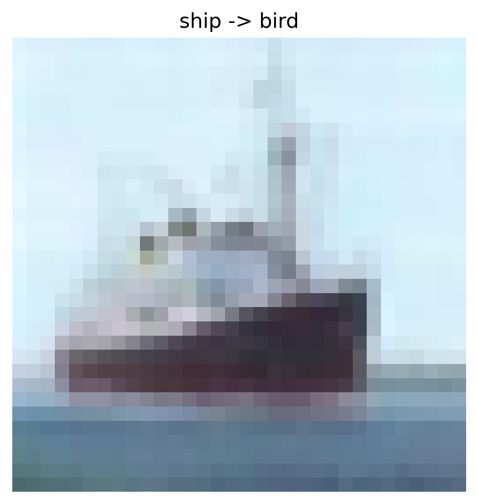
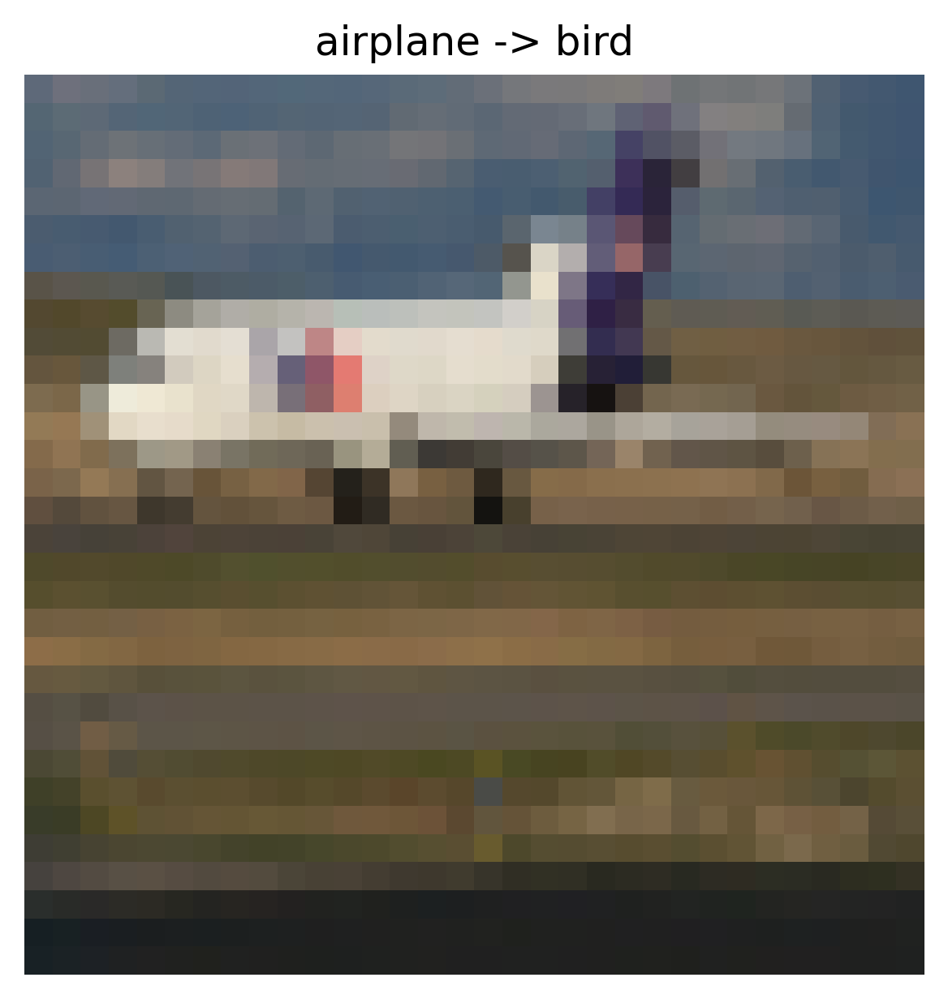
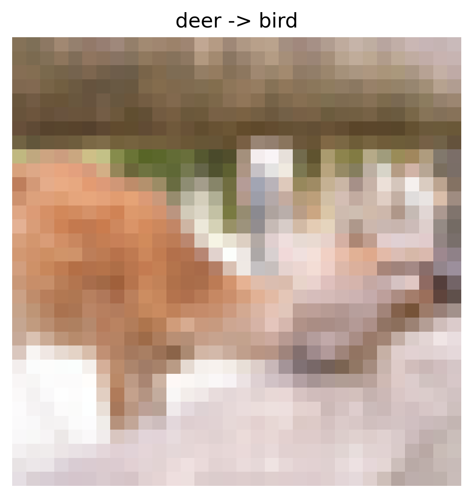
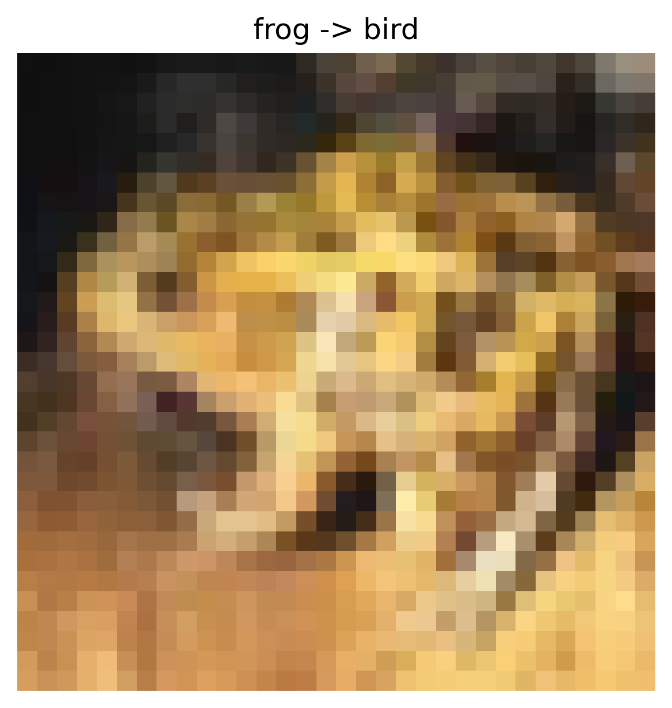
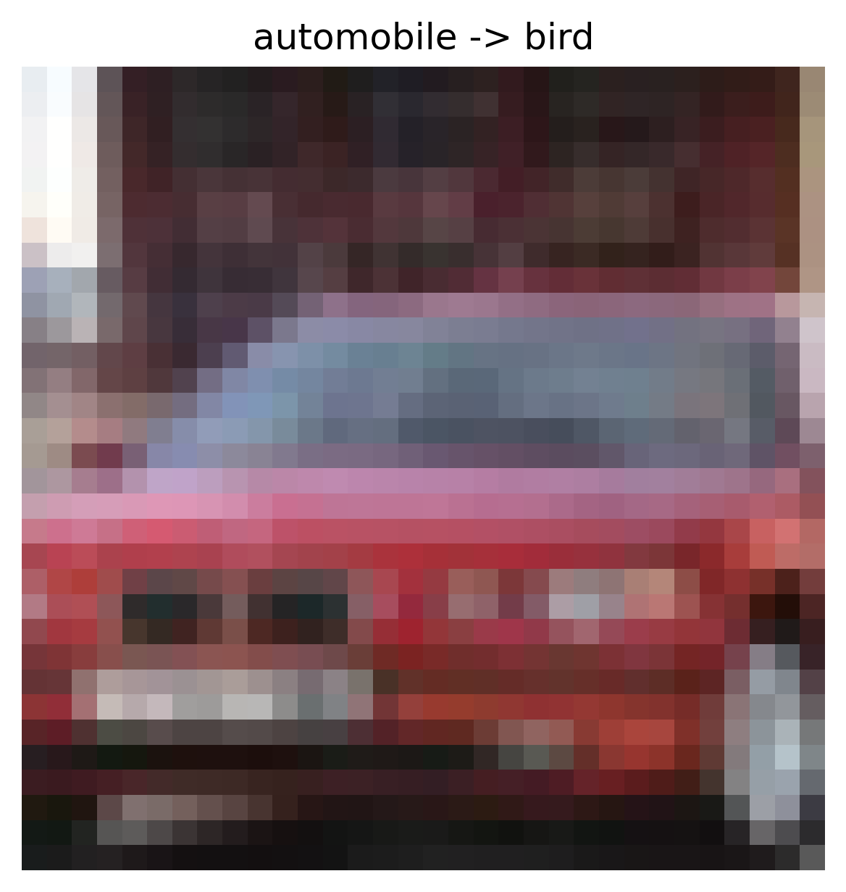

# Data Poisoning Attack Report

## Overview

- **Attack Type:** label_flipping
- **Strategy:** many_to_one
- **Flip Rate:** 0.1
- **Target Class:** 2
- **Source Classes:** All except target
- **Number of Flipped Samples:** 4047

## Performance Metrics

- **Accuracy After Attack:** 0.5471

### Per-Class Accuracy

| Class | Accuracy |
|--------|----------|
| airplane | 0.4760 |
| automobile | 0.7930 |
| bird | 0.4890 |
| cat | 0.3430 |
| deer | 0.2110 |
| dog | 0.4560 |
| frog | 0.9100 |
| horse | 0.4310 |
| ship | 0.7150 |
| truck | 0.6470 |

## Flip Summary

| Original -> New | Count |
|------------------|--------|
| ship->bird | 466 |
| airplane->bird | 459 |
| deer->bird | 435 |
| frog->bird | 432 |
| automobile->bird | 460 |
| cat->bird | 422 |
| dog->bird | 464 |
| truck->bird | 470 |
| horse->bird | 439 |

## Example Flips

| Index | Original Label | New Label |
|--------|----------------|-----------|
| 28153 | ship | bird |
| 25189 | airplane | bird |
| 14429 | deer | bird |
| 34539 | frog | bird |
| 47989 | automobile | bird |

## Visual Flip Examples (first 5)

<small><strong>ship -> bird</strong></small> 

<small><strong>airplane -> bird</strong></small> 

<small><strong>deer -> bird</strong></small> 

<small><strong>frog -> bird</strong></small> 

<small><strong>automobile -> bird</strong></small> 

