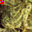
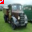
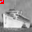
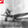

# Backdoor Attack Report — Learned Trigger

## Overview

- **Attack Type:** learned_trigger
- **Patch Size Ratio:** 0.15
- **Poisoned Fraction:** 0.1
- **Label Mode:** corrupted
- **Target Class:** 4 (deer)
- **Learning Rate:** 0.01
- **Trigger Optimisation Epochs:** 10
- **Mask‑L1 Weight (λ₁):** 0.001
- **Total‑Variation Weight (λ_tv):** 0.01

## Performance Metrics

- **Accuracy on Clean Test Set (CDA):** 0.5422

## Attack Success Rate (ASR)

- **ASR:** 1.0000
- **Successful Targeted Predictions:** 9000 / 9000

### Per‑Class Accuracy (Clean Test Set)

| Class | Accuracy |
|-------|----------|
| airplane | 0.5770 |
| automobile | 0.6540 |
| bird | 0.4950 |
| cat | 0.3520 |
| deer | 0.5140 |
| dog | 0.3850 |
| frog | 0.7500 |
| horse | 0.5000 |
| ship | 0.5600 |
| truck | 0.6350 |

## Learned Trigger & Mask

<small><strong>Trigger</strong></small> 

<small><strong>Mask (α)</strong></small> 

<small><strong>Overlay Preview</strong></small> 

## Example Poisoned Training Samples

<small>poison_29336_deer.png</small> 

<small>poison_16208_deer.png</small> 

<small>poison_11921_deer.png</small> 

<small>poison_31002_deer.png</small> 

<small>poison_6087_deer.png</small> 

**Average perturbation ‖δ‖₂ of shown samples:** 22.0372
