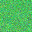

# Backdoor Attack Report — Learned Trigger

## Overview

- **Attack Type:** learned_trigger
- **Patch Size Ratio:** N/A
- **Poisoned Fraction:** 0.05
- **Label Mode:** corrupted
- **Target Class:** 7 (horse)
- **Trigger Learning Rate:** 0.01
- **Trigger Optimisation Epochs:** 20
- **Mask-L1 Weight (λ_mask):** 0.001
- **Total-Variation Weight (λ_tv):** 0.01

## Performance Metrics

- **Accuracy on Clean Test Set (CDA):** 0.6399

## Attack Success Rate (ASR)

- **Overall ASR:** 0.9850
- **Successful Targeted Predictions:** 985 / 1000

### ASR by Original Class

| Original Class | ASR (%) | Successful Attacks | Total Samples |
|----------------|---------|--------------------|---------------|
| airplane | 100.00% | 125 | 125 |
| automobile | 95.24% | 100 | 105 |
| bird | 100.00% | 91 | 91 |
| cat | 99.25% | 132 | 133 |
| deer | 97.56% | 120 | 123 |
| dog | 99.07% | 107 | 108 |
| frog | 95.19% | 99 | 104 |
| horse | 0.00% | 0 | 0 |
| ship | 100.00% | 109 | 109 |
| truck | 100.00% | 102 | 102 |

### Per‑Class Accuracy (Clean Test Set)

| Class | Accuracy |
|-------|----------|
| airplane | 0.8310 |
| automobile | 0.8750 |
| bird | 0.6040 |
| cat | 0.3740 |
| deer | 0.5550 |
| dog | 0.3840 |
| frog | 0.8110 |
| horse | 0.6660 |
| ship | 0.6200 |
| truck | 0.6790 |

## Learned Trigger & Mask

<small><strong>Trigger</strong></small> 

<small><strong>Mask (α)</strong></small> 

<small><strong>Overlay Preview</strong></small> 

## Example Poisoned Training Samples

<small>poison_123_horse.png</small> 

<small>poison_19_horse.png</small> 

<small>poison_44_horse.png</small> 

<small>poison_65_horse.png</small> 

<small>poison_95_horse.png</small> 

**Average perturbation ‖δ‖₂ of shown samples:** 2.1304
