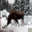
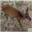

# Backdoor Attack Report — Static Patch

## Overview

- **Attack Type:** static_patch
- **Patch Type:** white_square
- **Patch Size Ratio:** 0.15
- **Patch Position:** bottom_right
- **Poisoned Fraction:** 0.15
- **Label Mode:** corrupted
- **Blending Alpha:** 1.0
- **Target Class:** 7 (horse)

## Performance Metrics

- **Accuracy on Clean Test Set:** 0.6940

## Attack Success Rate (ASR)

- **Overall ASR:** 0.0300 
### ASR by Original Class

| Original Class | ASR (%) |
|----------------|---------|
| airplane | 3.74% |
| automobile | 0.85% |
| bird | 4.21% |
| cat | 1.90% |
| deer | 9.80% |
| dog | 3.91% |
| frog | 0.86% |
| horse | 0.00% |
| ship | 0.84% |
| truck | 1.82% |

### Per-Class Accuracy (Clean Test Set)

| Class | Accuracy |
|--------|----------|
| airplane | 0.7360 |
| automobile | 0.7790 |
| bird | 0.5890 |
| cat | 0.5030 |
| deer | 0.6600 |
| dog | 0.5970 |
| frog | 0.7720 |
| horse | 0.7490 |
| ship | 0.8160 |
| truck | 0.7390 |

## Example Poisoned Samples

<small><strong>poison_6664_deer.png</strong></small> 

<small><strong>poison_9668_deer.png</strong></small> 

<small><strong>poison_1272_deer.png</strong></small> 

<small><strong>poison_6454_deer.png</strong></small> 

<small><strong>poison_8491_cat.png</strong></small> 

