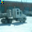
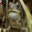

# Backdoor Attack Report — Static Patch

## Overview

- **Attack Type:** static_patch
- **Patch Type:** random_noise
- **Patch Size Ratio:** 0.15
- **Patch Position:** top_left
- **Poisoned Fraction:** 0.1
- **Target Class:** 7 (horse)

## Performance Metrics

- **Accuracy on Clean Test Set:** 0.6177

## Attack Success Rate (ASR)

- **ASR:** 0.9671
- **Successful Targeted Predictions:** 8704 / 9000

### Per-Class Accuracy (Clean Test Set)

| Class | Accuracy |
|--------|----------|
| airplane | 0.6270 |
| automobile | 0.7610 |
| bird | 0.4380 |
| cat | 0.3260 |
| deer | 0.4900 |
| dog | 0.6540 |
| frog | 0.6070 |
| horse | 0.7380 |
| ship | 0.8120 |
| truck | 0.7240 |

## Example Poisoned Samples

<small><strong>poison_43115_horse.png</strong></small> 

<small><strong>poison_31094_horse.png</strong></small> 

<small><strong>poison_36180_horse.png</strong></small> 

<small><strong>poison_6096_horse.png</strong></small> 

<small><strong>poison_5598_horse.png</strong></small> 

