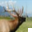
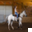
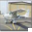
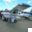

# Backdoor Attack Report — Static Patch

## Overview

- **Attack Type:** static_patch
- **Patch Type:** white_square
- **Patch Size Ratio:** 0.15
- **Patch Position:** bottom_right
- **Poisoned Fraction:** 0.05
- **Label Mode:** corrupted
- **Blending Alpha:** 1.0
- **Target Class:** 1 (automobile)

## Performance Metrics

- **Accuracy on Clean Test Set:** 0.6662

## Attack Success Rate (ASR)

- **Overall ASR:** 0.9230 (923 / 1000)

### ASR by Original Class

| Original Class | ASR (%) | Successful Attacks | Total Samples |
|----------------|---------|--------------------|---------------|
| airplane | 87.18% | 102 | 117 |
| automobile | 0.00% | 0 | 0 |
| bird | 94.32% | 83 | 88 |
| cat | 91.92% | 91 | 99 |
| deer | 96.40% | 107 | 111 |
| dog | 90.83% | 99 | 109 |
| frog | 94.89% | 130 | 137 |
| horse | 87.50% | 98 | 112 |
| ship | 98.39% | 122 | 124 |
| truck | 88.35% | 91 | 103 |

### Per-Class Accuracy (Clean Test Set)

| Class | Accuracy |
|--------|----------|
| airplane | 0.6830 |
| automobile | 0.7330 |
| bird | 0.4620 |
| cat | 0.4540 |
| deer | 0.7100 |
| dog | 0.6040 |
| frog | 0.8410 |
| horse | 0.6500 |
| ship | 0.6780 |
| truck | 0.8470 |

## Example Poisoned Samples

<small><strong>poison_769_deer.png</strong></small> 

<small><strong>poison_7859_horse.png</strong></small> 

<small><strong>poison_6799_airplane.png</strong></small> 

<small><strong>poison_5837_bird.png</strong></small> 

<small><strong>poison_6001_airplane.png</strong></small> 

