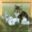
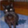
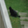
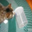

# Backdoor Attack Report — Static Patch

## Overview

- **Attack Type:** static_patch
- **Patch Type:** white_square
- **Patch Size Ratio:** 0.15
- **Patch Position:** bottom_right
- **Poisoned Fraction:** 0.05
- **Label Mode:** clean
- **Blending Alpha:** 0.25
- **Target Class:** 3 (cat)

## Performance Metrics

- **Accuracy on Clean Test Set:** 0.6058

## Attack Success Rate (ASR)

- **ASR:** 0.7799
- **Successful Targeted Predictions:** 7019 / 9000

### Per-Class Accuracy (Clean Test Set)

| Class | Accuracy |
|--------|----------|
| airplane | 0.5940 |
| automobile | 0.8360 |
| bird | 0.4790 |
| cat | 0.3350 |
| deer | 0.5360 |
| dog | 0.3650 |
| frog | 0.8140 |
| horse | 0.7480 |
| ship | 0.8570 |
| truck | 0.4940 |

## Example Poisoned Samples

<small><strong>poison_11996_cat.png</strong></small> 

<small><strong>poison_31950_cat.png</strong></small> 

<small><strong>poison_12137_cat.png</strong></small> 

<small><strong>poison_43958_cat.png</strong></small> 

<small><strong>poison_5934_cat.png</strong></small> 

