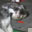
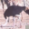

# Backdoor Attack Report — Static Patch

## Overview

- **Attack Type:** static_patch
- **Patch Type:** white_square
- **Patch Size Ratio:** 0.15
- **Patch Position:** bottom_right
- **Poisoned Fraction:** 0.05
- **Label Mode:** corrupted
- **Blending Alpha:** 1.0
- **Target Class:** 7 (horse)

## Performance Metrics

- **Accuracy on Clean Test Set:** 0.7004

## Attack Success Rate (ASR)

- **Overall ASR:** 0.0300 
### ASR by Original Class

| Original Class | ASR (%) |
|----------------|---------|
| airplane | 3.60% |
| automobile | 0.00% |
| bird | 3.60% |
| cat | 2.80% |
| deer | 8.04% |
| dog | 5.17% |
| frog | 0.00% |
| horse | 0.00% |
| ship | 0.96% |
| truck | 2.50% |

### Per-Class Accuracy (Clean Test Set)

| Class | Accuracy |
|--------|----------|
| airplane | 0.7700 |
| automobile | 0.7860 |
| bird | 0.5650 |
| cat | 0.5130 |
| deer | 0.6720 |
| dog | 0.5850 |
| frog | 0.7860 |
| horse | 0.7490 |
| ship | 0.8150 |
| truck | 0.7630 |

## Example Poisoned Samples

<small><strong>poison_9445_truck.png</strong></small> 

<small><strong>poison_483_dog.png</strong></small> 

<small><strong>poison_2331_bird.png</strong></small> 

<small><strong>poison_5460_airplane.png</strong></small> 

<small><strong>poison_9940_deer.png</strong></small> 

