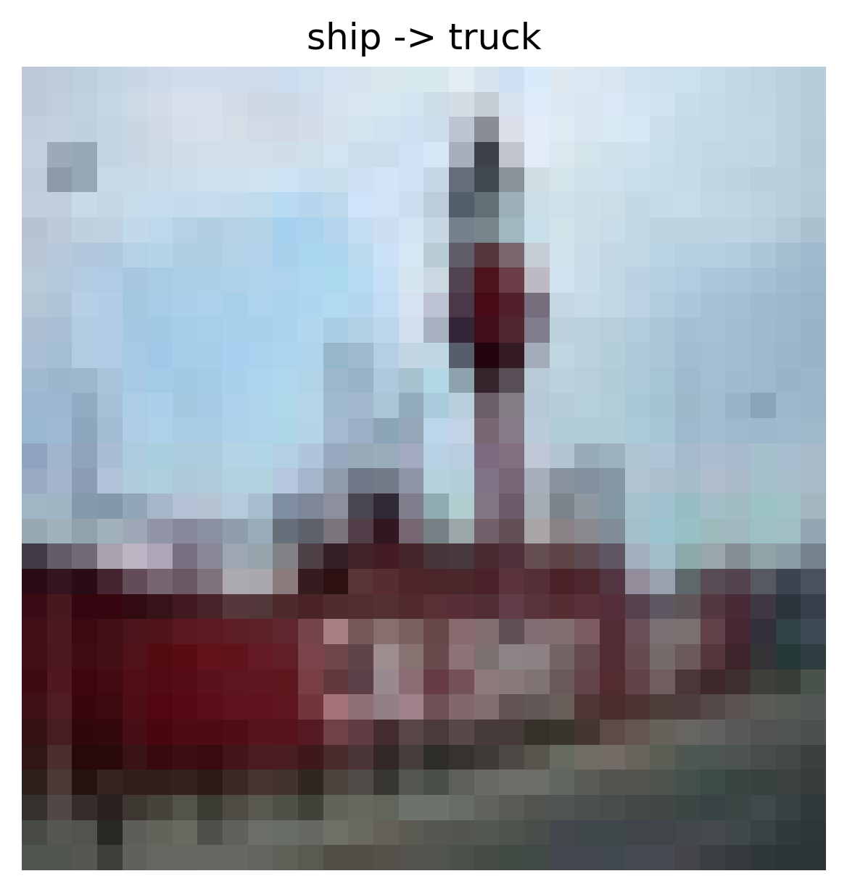
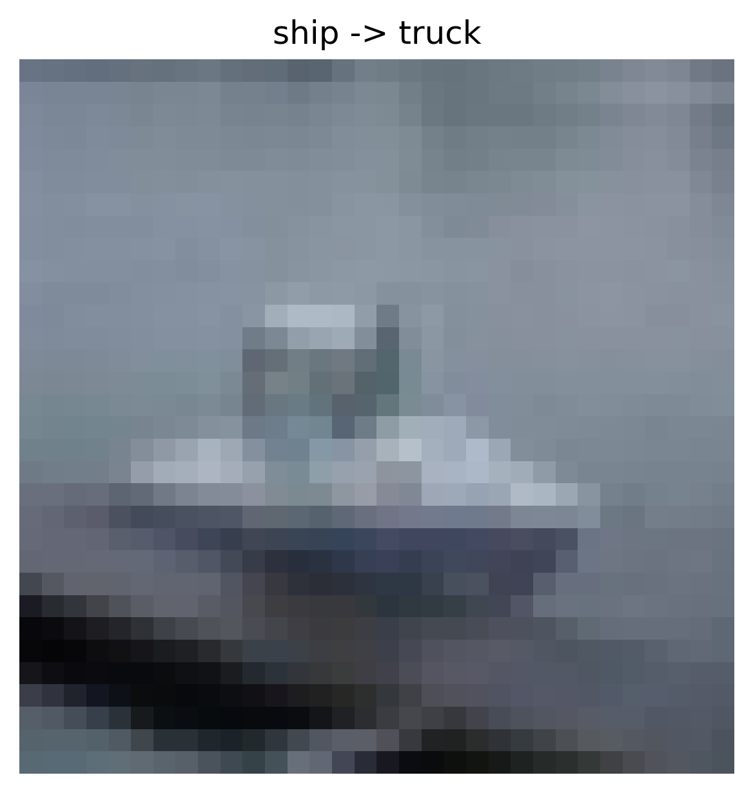
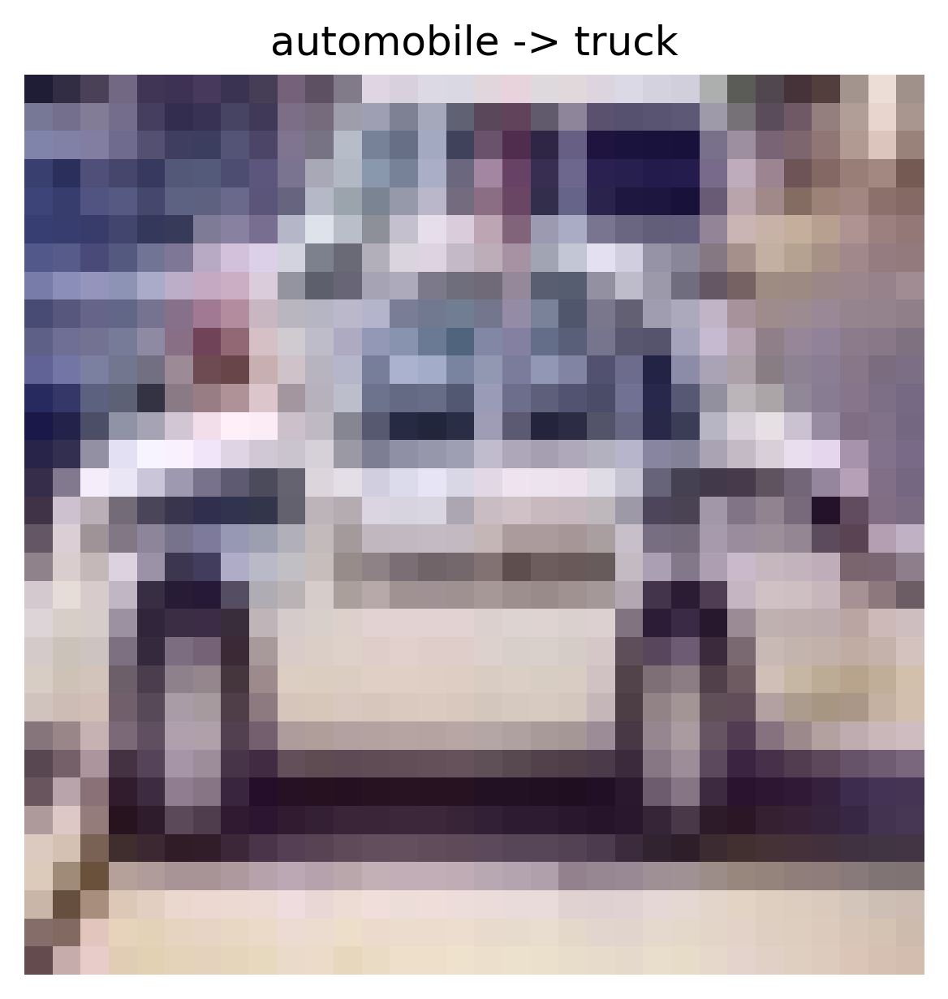
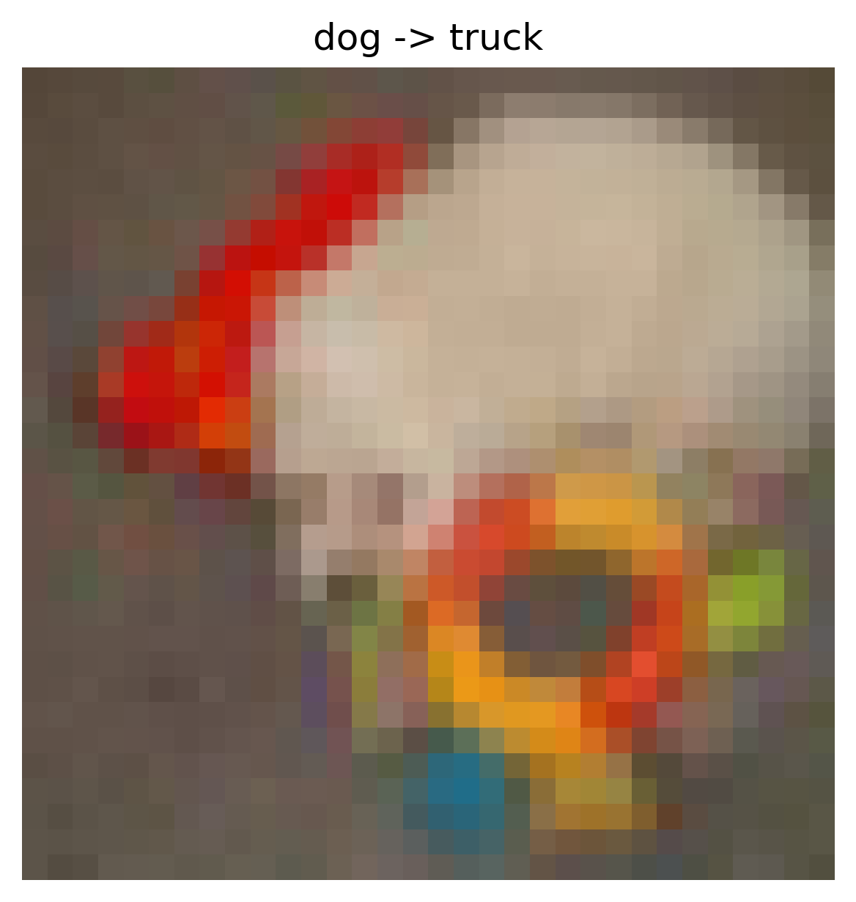
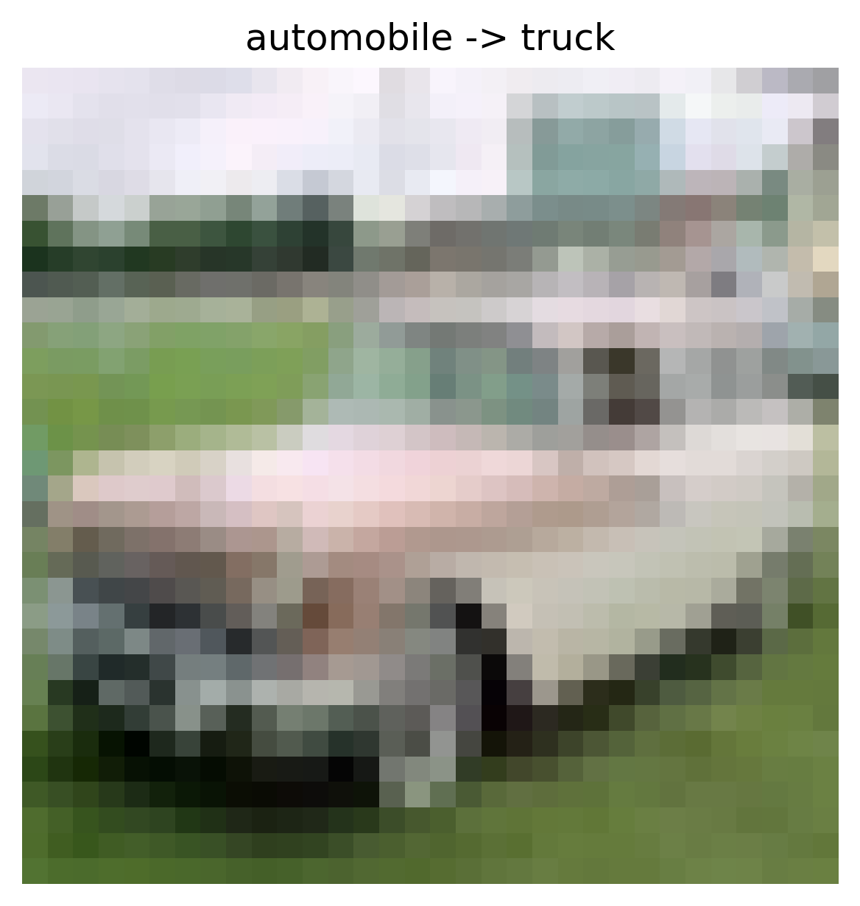

# Data Poisoning - Label Flipping Attack Report

## Overview

- **Attack Type:** label_flipping
- **Strategy:** many_to_one
- **Flip Rate:** 0.08
- **Target Class:** 9
- **Source Classes:** All except target
- **Number of Flipped Samples:** 3240

## Performance Metrics

- **Accuracy After Attack:** 0.6578

### Per-Class Accuracy

| Class | Accuracy |
|--------|----------|
| airplane | 0.7110 |
| automobile | 0.7080 |
| bird | 0.5050 |
| cat | 0.4180 |
| deer | 0.6010 |
| dog | 0.5890 |
| frog | 0.7570 |
| horse | 0.7120 |
| ship | 0.7780 |
| truck | 0.7990 |

## Flip Summary

| Original -> New | Count |
|------------------|--------|
| ship->truck | 361 |
| automobile->truck | 363 |
| dog->truck | 384 |
| bird->truck | 362 |
| frog->truck | 332 |
| deer->truck | 353 |
| airplane->truck | 349 |
| cat->truck | 347 |
| horse->truck | 389 |

## Example Flips

| Index | Original Label | New Label |
|--------|----------------|-----------|
| 39442 | ship | truck |
| 26239 | ship | truck |
| 13006 | automobile | truck |
| 17898 | dog | truck |
| 18331 | automobile | truck |

## Visual Flip Examples (first 5)

<small><strong>ship -> truck</strong></small> 

<small><strong>ship -> truck</strong></small> 

<small><strong>automobile -> truck</strong></small> 

<small><strong>dog -> truck</strong></small> 

<small><strong>automobile -> truck</strong></small> 

