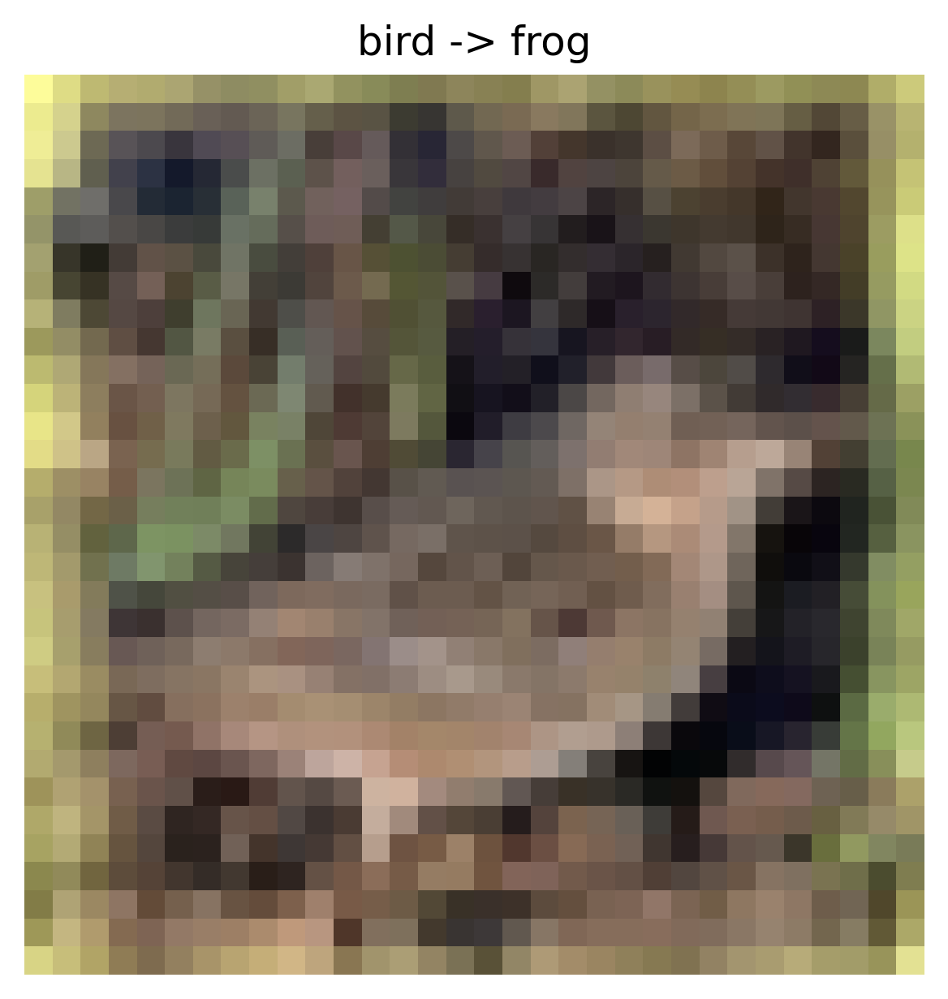
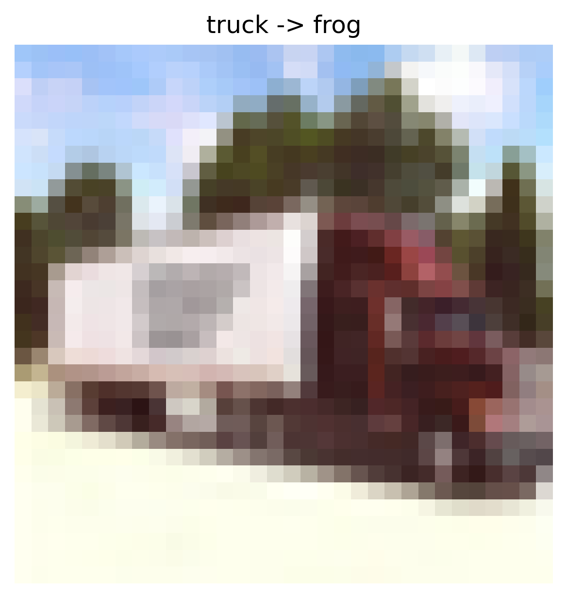
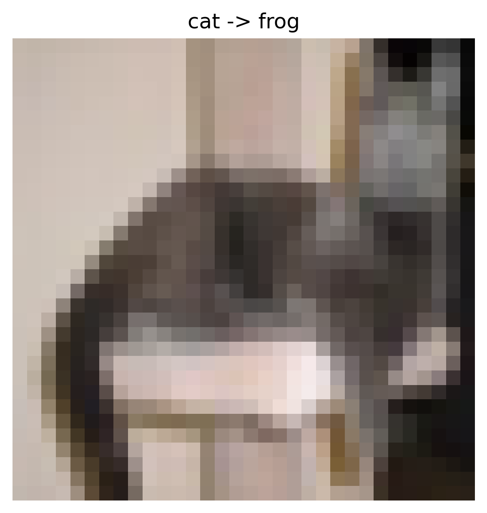
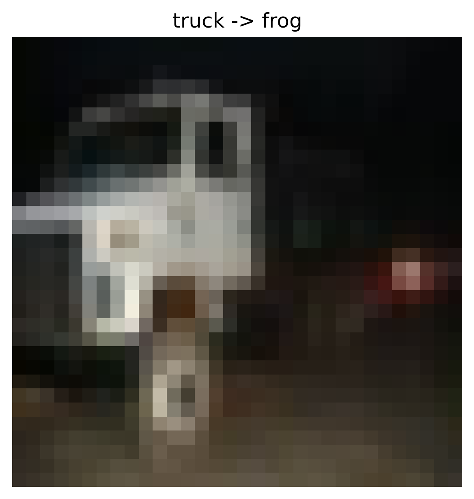
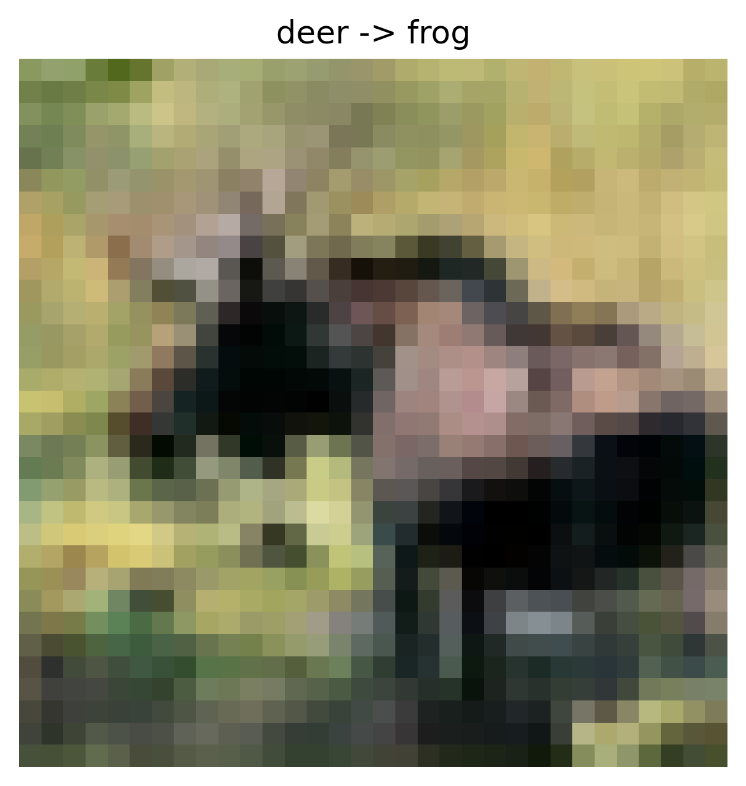

#Data Poisoning - Label Flipping Attack Report

## Overview

- **Attack Type:** label_flipping
- **Strategy:** many_to_one
- **Flip Rate:** 0.1
- **Target Class:** 6
- **Source Classes:** All except target
- **Number of Flipped Samples:** 4049

## Performance Metrics

- **Accuracy After Attack:** 0.5488

### Per-Class Accuracy

| Class | Accuracy |
|--------|----------|
| airplane | 0.6820 |
| automobile | 0.7420 |
| bird | 0.4400 |
| cat | 0.3380 |
| deer | 0.3770 |
| dog | 0.3020 |
| frog | 0.8730 |
| horse | 0.4740 |
| ship | 0.7960 |
| truck | 0.4640 |

## Flip Summary

| Original -> New | Count |
|------------------|--------|
| bird->frog | 449 |
| truck->frog | 454 |
| cat->frog | 435 |
| deer->frog | 438 |
| dog->frog | 455 |
| automobile->frog | 436 |
| horse->frog | 475 |
| ship->frog | 424 |
| airplane->frog | 483 |

## Example Flips

| Index | Original Label | New Label |
|--------|----------------|-----------|
| 11193 | bird | frog |
| 47086 | truck | frog |
| 38999 | cat | frog |
| 4986 | truck | frog |
| 26417 | deer | frog |

## Visual Flip Examples (first 5)

<small><strong>bird -> frog</strong></small> 

<small><strong>truck -> frog</strong></small> 

<small><strong>cat -> frog</strong></small> 

<small><strong>truck -> frog</strong></small> 

<small><strong>deer -> frog</strong></small> 

