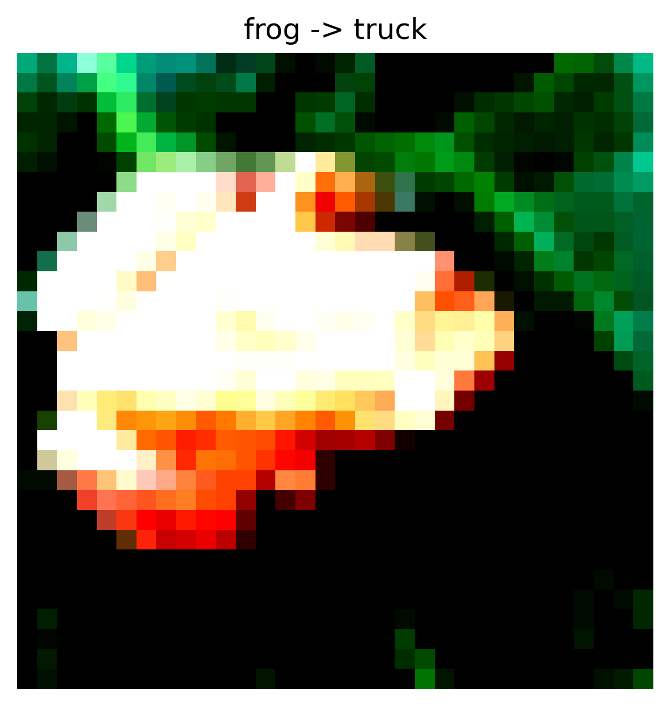
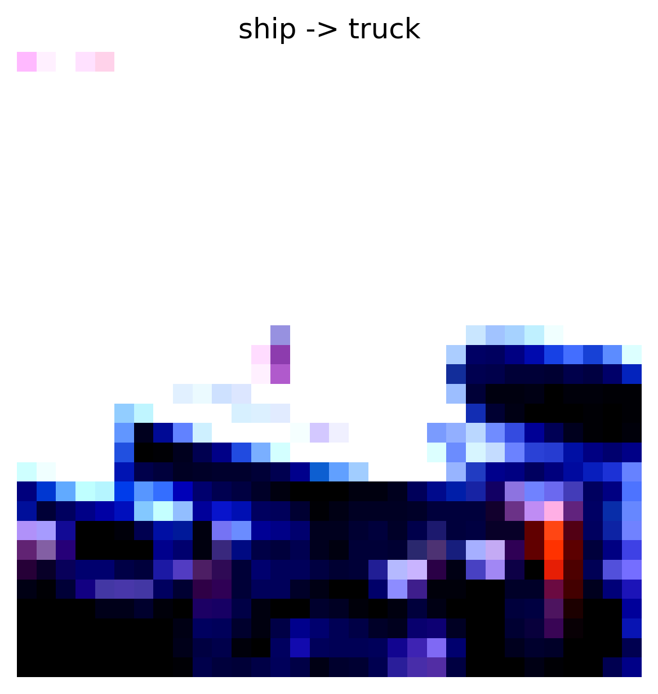
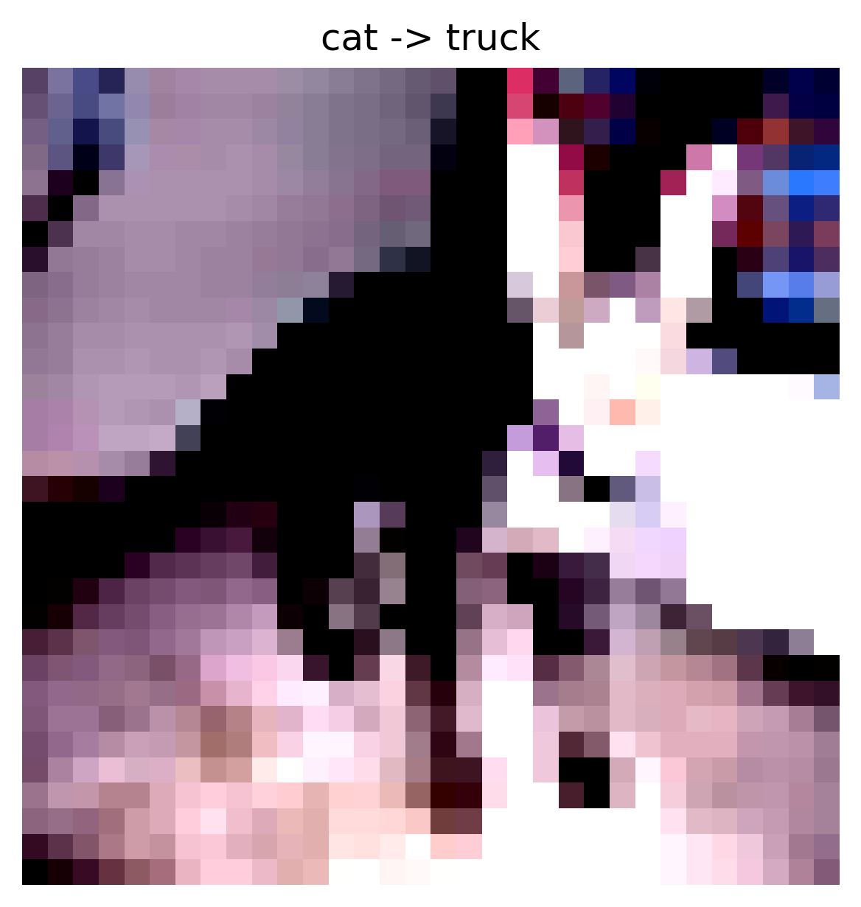
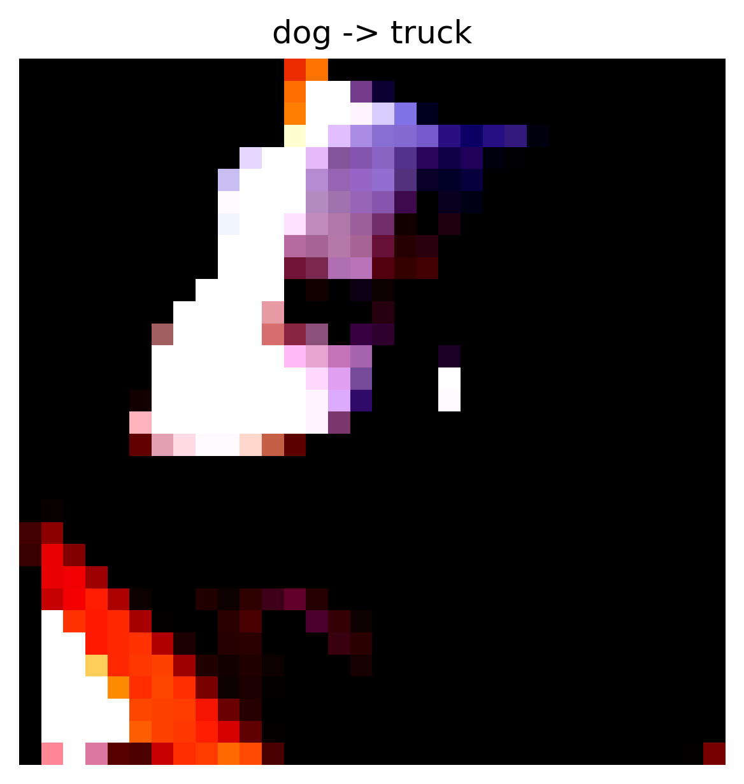
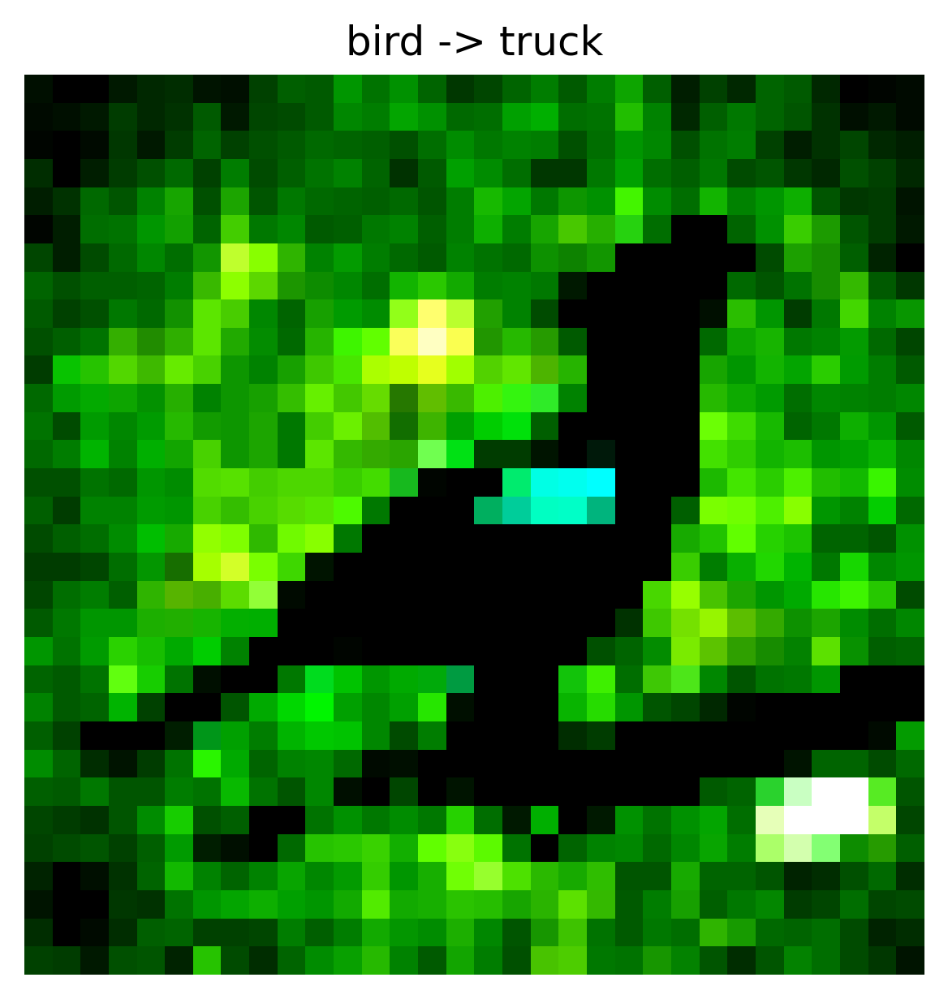

# Data Poisoning - Label Flipping Attack Report

## Overview

- **Attack Type:** label_flipping
- **Strategy:** many_to_one
- **Flip Rate:** 0.15
- **Target Class:** 9
- **Source Classes:** All except target
- **Number of Flipped Samples:** 6077

## Performance Metrics

- **Accuracy After Attack:** 0.6337

### Per-Class Accuracy

| Class | Accuracy |
|--------|----------|
| airplane | 0.6960 |
| automobile | 0.6670 |
| bird | 0.5030 |
| cat | 0.3940 |
| deer | 0.5900 |
| dog | 0.5240 |
| frog | 0.7260 |
| horse | 0.6730 |
| ship | 0.7200 |
| truck | 0.8440 |

## Flip Summary

| Original -> New | Count |
|------------------|--------|
| frog->truck | 639 |
| ship->truck | 670 |
| cat->truck | 708 |
| dog->truck | 653 |
| bird->truck | 715 |
| automobile->truck | 690 |
| horse->truck | 652 |
| airplane->truck | 708 |
| deer->truck | 642 |

## Example Flips

| Index | Original Label | New Label |
|--------|----------------|-----------|
| 46043 | frog | truck |
| 47971 | ship | truck |
| 17098 | cat | truck |
| 24516 | dog | truck |
| 6704 | bird | truck |

## Visual Flip Examples (first 5)

<small><strong>frog -> truck</strong></small> 

<small><strong>ship -> truck</strong></small> 

<small><strong>cat -> truck</strong></small> 

<small><strong>dog -> truck</strong></small> 

<small><strong>bird -> truck</strong></small> 

