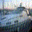
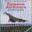

# Evasion Attack Report — Transfer-Based Attack

## Overview

- **Attack Type:** transfer_fgsm
- **Substitute Model:** cnn

## Performance Metrics

- **Accuracy on Clean Test Set (CDA):** 0.6754
- **Accuracy on Adversarial Test Set (ADA):** 0.2001

### Per‑Class Accuracy (Clean Test Set)

| Class | Accuracy |
|-------|----------|
| airplane | 0.6720 |
| automobile | 0.7830 |
| bird | 0.6380 |
| cat | 0.3570 |
| deer | 0.6360 |
| dog | 0.6080 |
| frog | 0.6940 |
| horse | 0.7840 |
| ship | 0.8620 |
| truck | 0.7200 |

### Per‑Class Accuracy (Adversarial Test Set)

| Class | Accuracy |
|-------|----------|
| airplane | 0.2110 |
| automobile | 0.2120 |
| bird | 0.1650 |
| cat | 0.0780 |
| deer | 0.2850 |
| dog | 0.1190 |
| frog | 0.2020 |
| horse | 0.1990 |
| ship | 0.3270 |
| truck | 0.2030 |

## Example Adversarial Samples

The following examples illustrate adversarial inputs generated by the transfer-based attack. Each image is named using the format:

```
transfer_<index>_<true_class>_<pred_adv_class>.png
```
- `<index>`: Sample index in the test set.
- `<true_class>`: Ground truth label.
- `<pred_adv_class>`: Predicted label after attack.

<div style="display: flex; gap: 10px; flex-wrap: wrap;">
<div style="text-align:center; margin: 5px;"><small>examples/transfer_0_cat_ship.png</small><br></div>
<div style="text-align:center; margin: 5px;"><small>examples/transfer_1_ship_ship.png</small><br></div>
<div style="text-align:center; margin: 5px;"><small>examples/transfer_2_ship_airplane.png</small><br></div>
<div style="text-align:center; margin: 5px;"><small>examples/transfer_3_airplane_ship.png</small><br></div>
<div style="text-align:center; margin: 5px;"><small>examples/transfer_4_frog_deer.png</small><br></div>
</div>