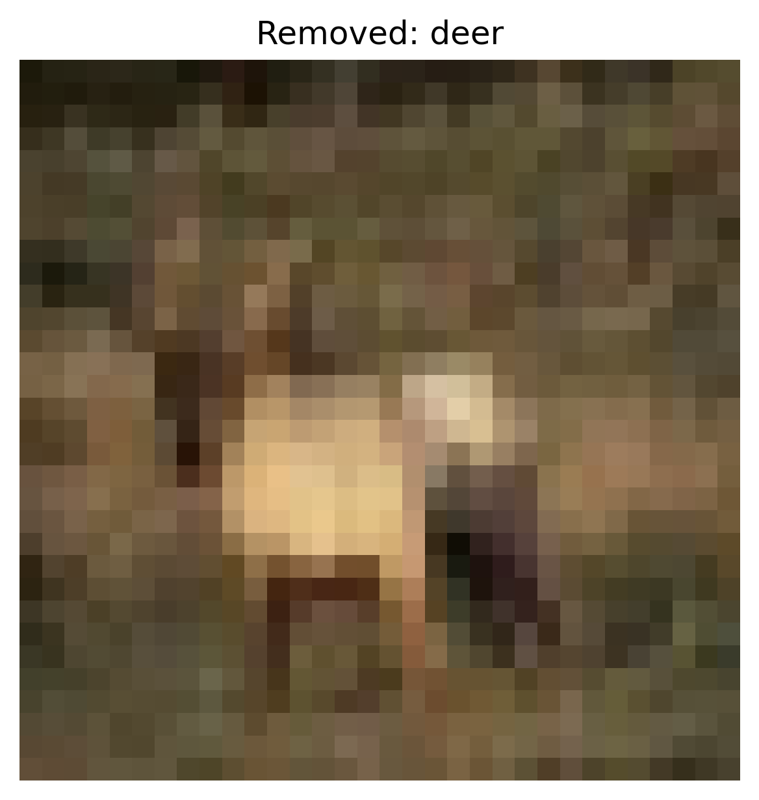
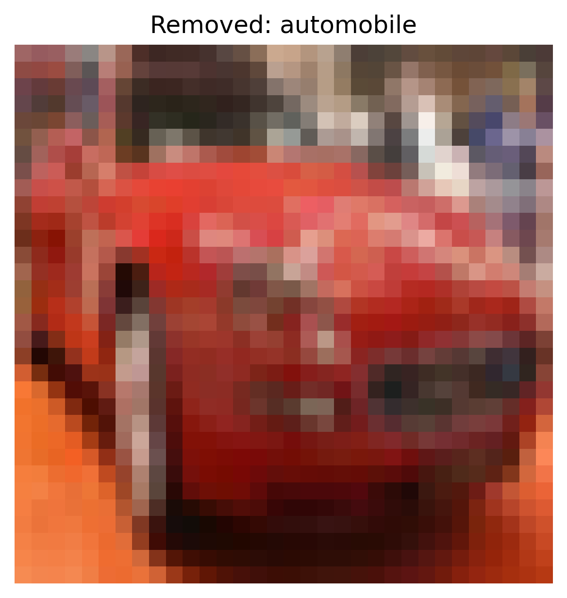
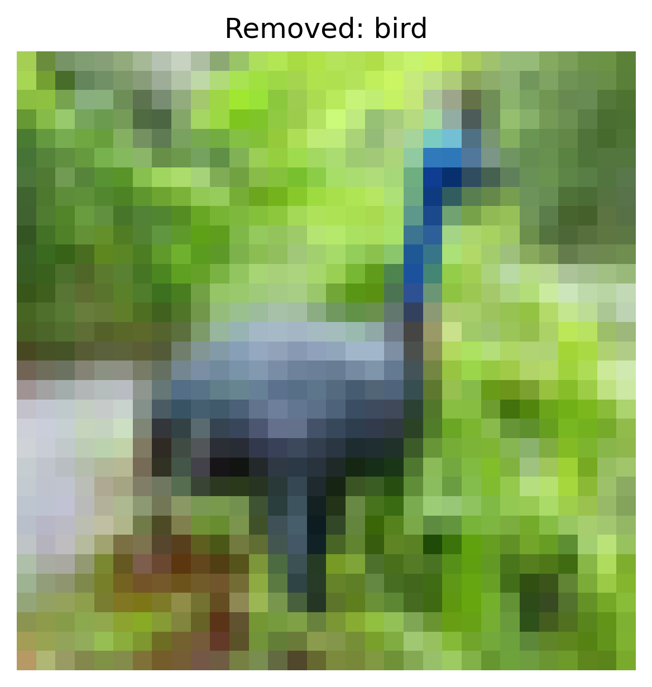

# Activation Clustering Report – Learned Trigger

## 1. Overview
- **Defense:** activation_clustering
- **Attack Type:** learned_trigger
- **Number of Removed Samples:** 19321
- **Defense Parameters:**
  - `num_clusters`: 2

## 2. Accuracy After Defense
- **Overall Accuracy:** `0.3969`

### Per-Class Accuracy
- **airplane**: `0.3550`
- **automobile**: `0.0000`
- **bird**: `0.5260`
- **cat**: `0.5400`
- **deer**: `0.7240`
- **dog**: `0.4380`
- **frog**: `0.8000`
- **horse**: `0.5800`
- **ship**: `0.0000`
- **truck**: `0.0060`

## 3. Removed Sample Examples (Cluster-based)

**Removed Sample — Class: frog**

**Removed Sample — Class: deer**

**Removed Sample — Class: automobile**

**Removed Sample — Class: bird**

**Removed Sample — Class: horse**

