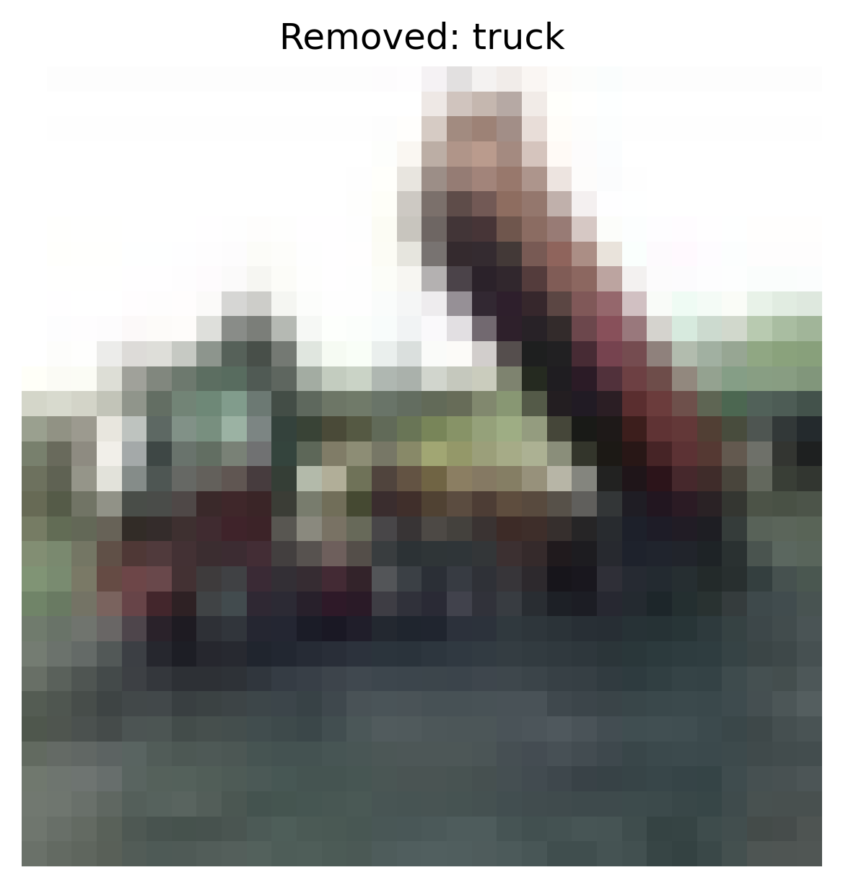
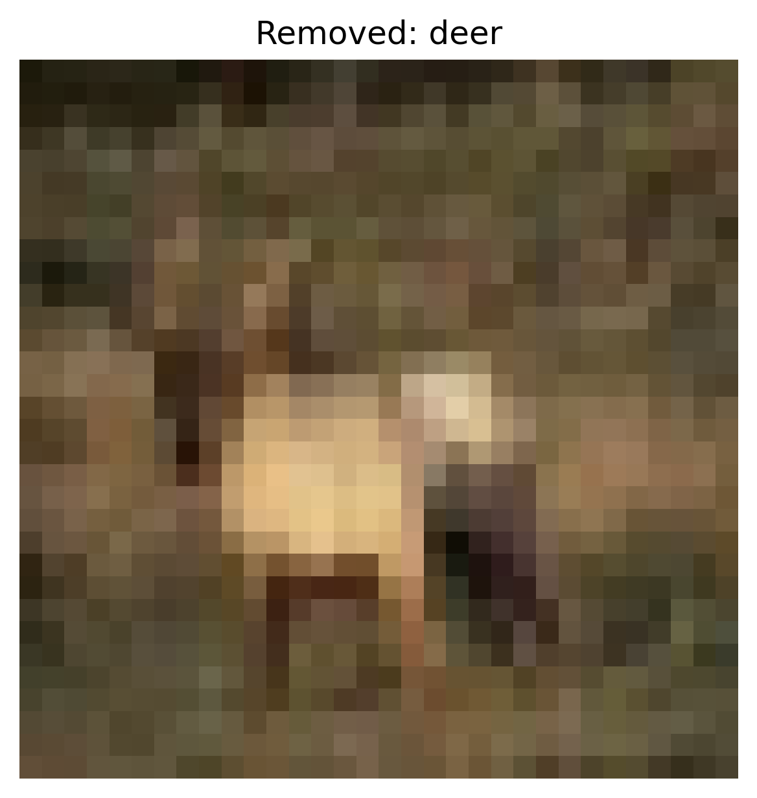
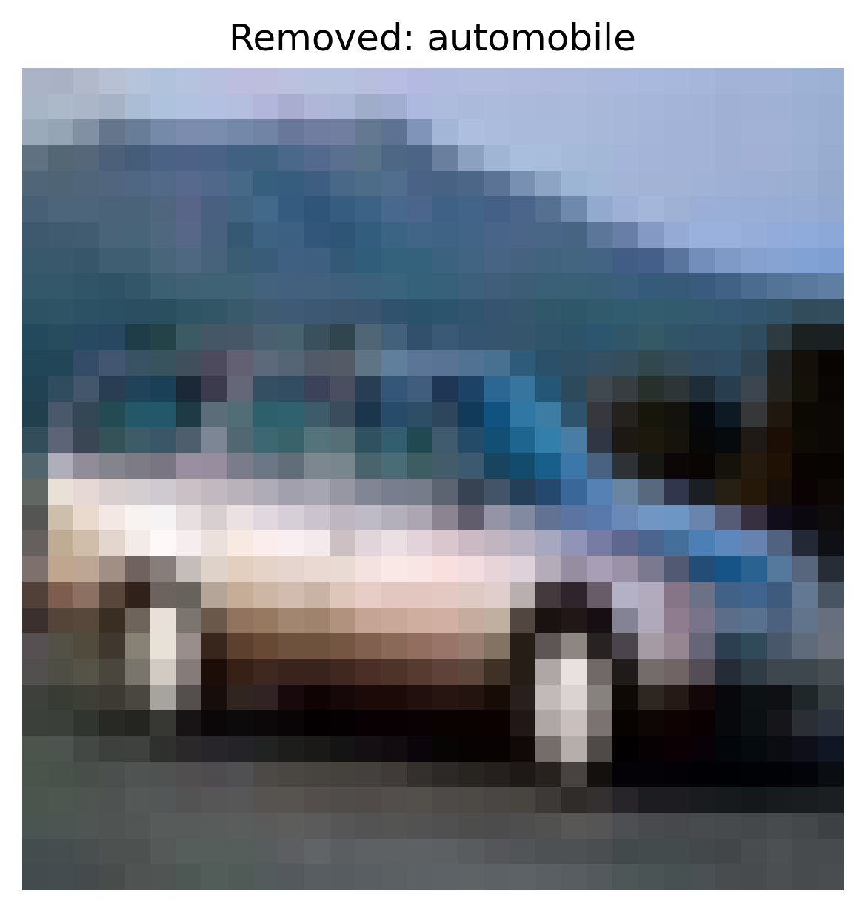
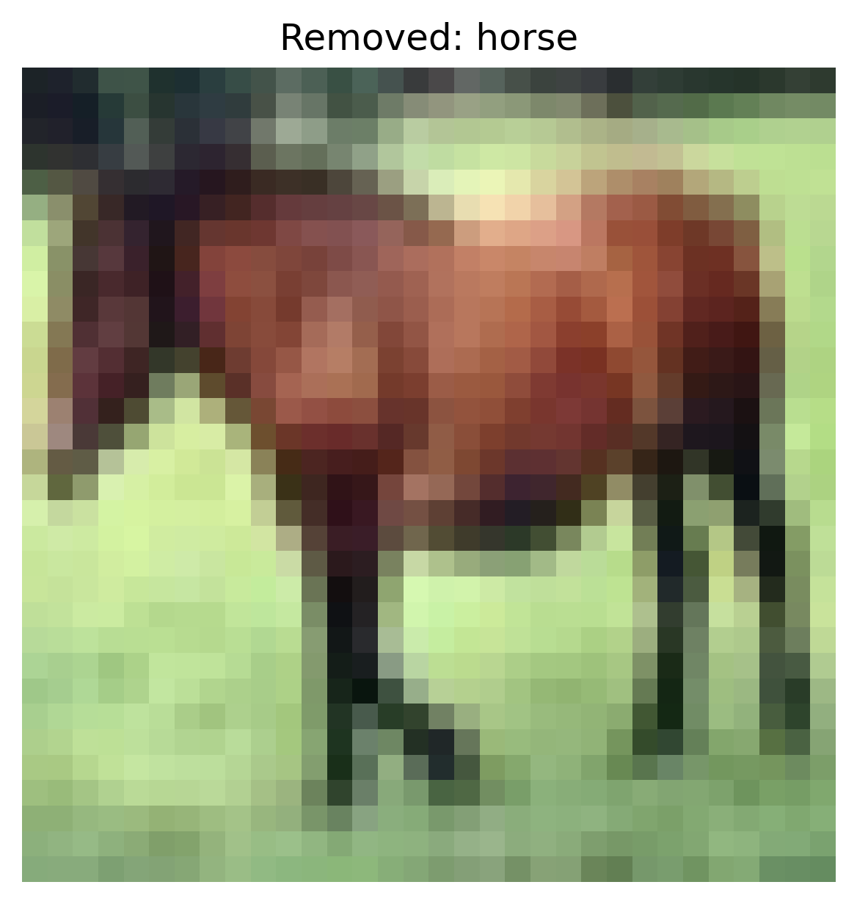
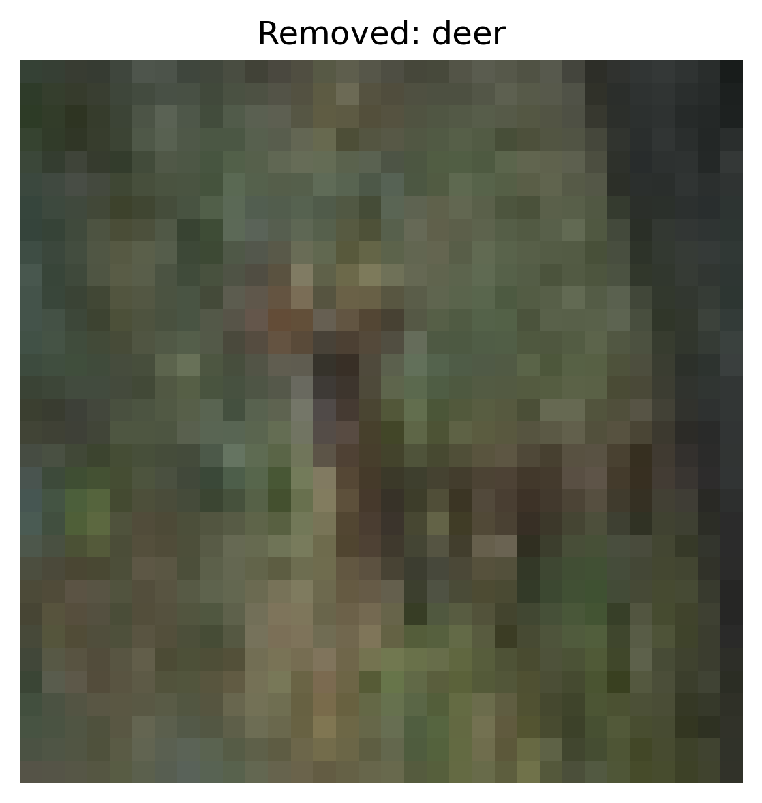

# Activation Clustering Report – Static Patch

## 1. Overview
- **Defense:** activation_clustering
- **Attack Type:** static_patch
- **Number of Removed Samples:** 18224
- **Defense Parameters:**
  - `num_clusters`: 2

## 2. Accuracy After Defense
- **Clean Test Set Accuracy:** `0.4386`
- **ASR After Defense:** `0.9024`

### Per-Class Accuracy (Clean)
- **airplane**: `0.6660`
- **automobile**: `0.0000`
- **bird**: `0.5030`
- **cat**: `0.3260`
- **deer**: `0.7960`
- **dog**: `0.6330`
- **frog**: `0.6650`
- **horse**: `0.7020`
- **ship**: `0.0950`
- **truck**: `0.0000`

### Per-Original-Class ASR
- **Original Class airplane**: `0.7830`
- **Original Class automobile**: `0.9080`
- **Original Class bird**: `0.8930`
- **Original Class cat**: `0.8880`
- **Original Class deer**: `0.9660`
- **Original Class dog**: `0.9160`
- **Original Class frog**: `0.8710`
- **Original Class ship**: `0.9640`
- **Original Class truck**: `0.9330`
## 3. Removed Sample Examples (Cluster-based)

**Removed Sample — Class: truck**

**Removed Sample — Class: deer**

**Removed Sample — Class: automobile**

**Removed Sample — Class: horse**

**Removed Sample — Class: deer**

