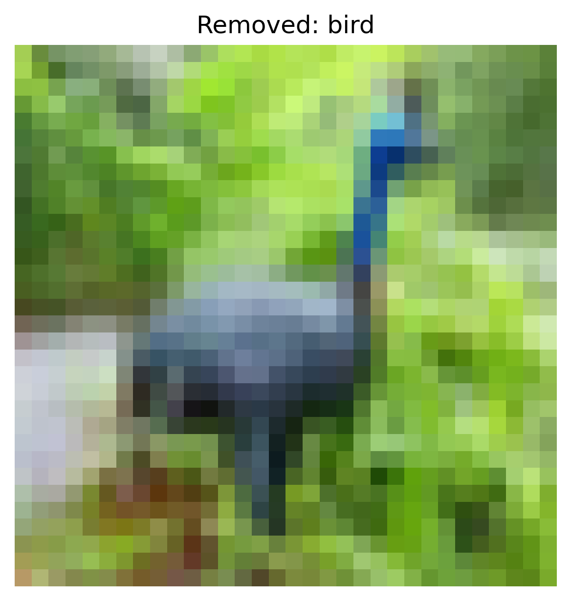
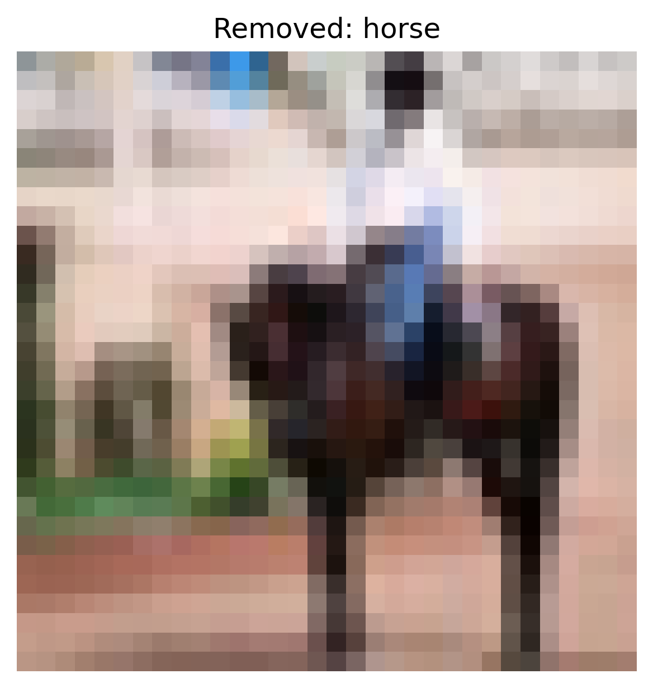
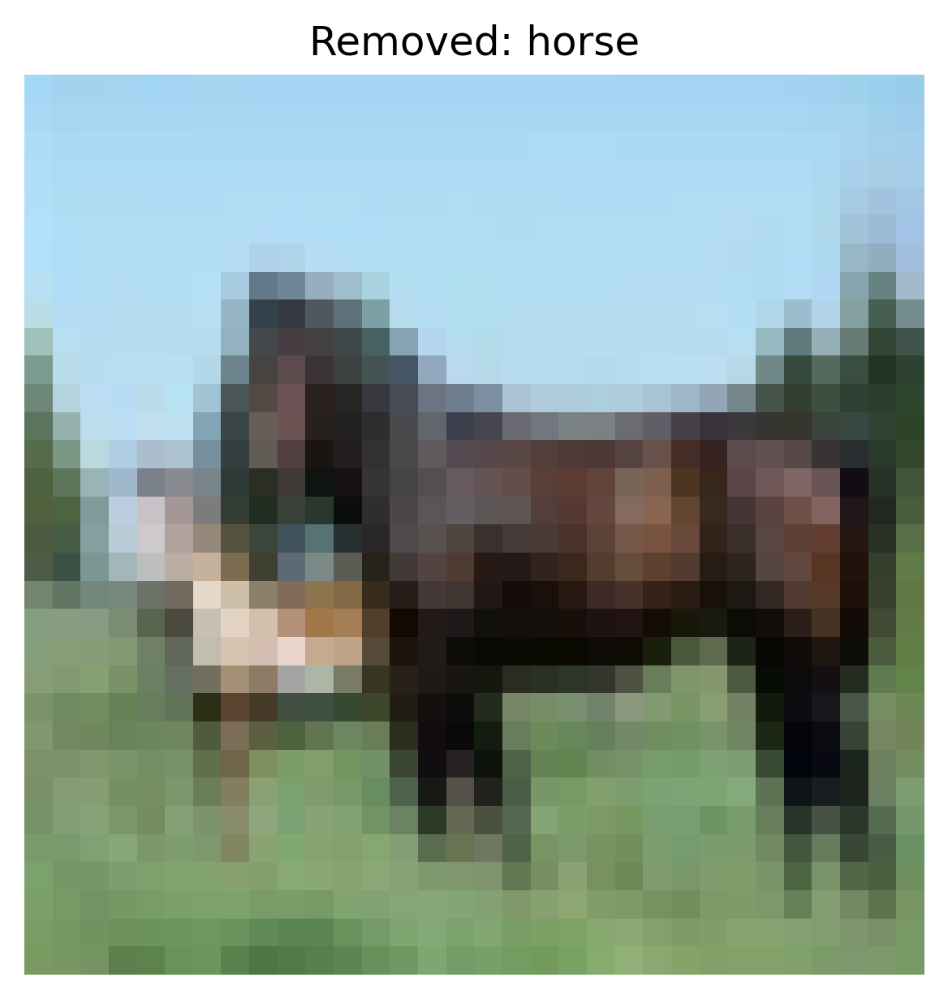
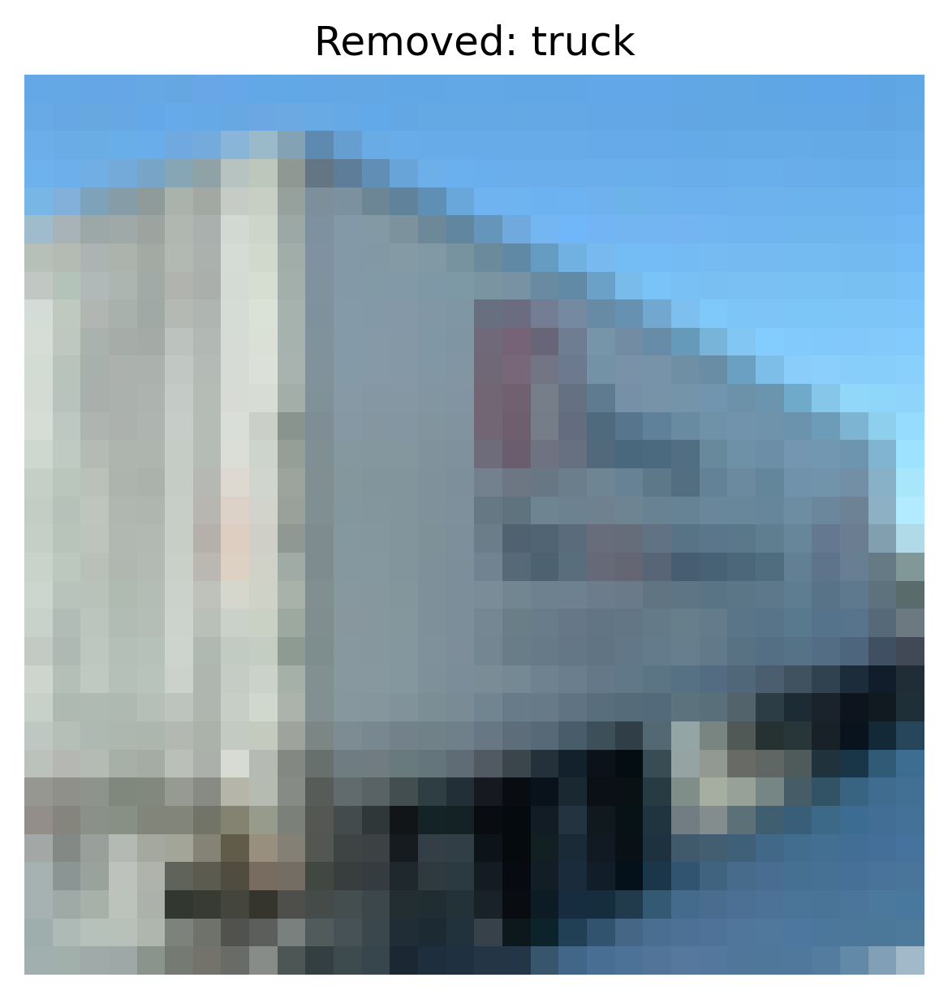
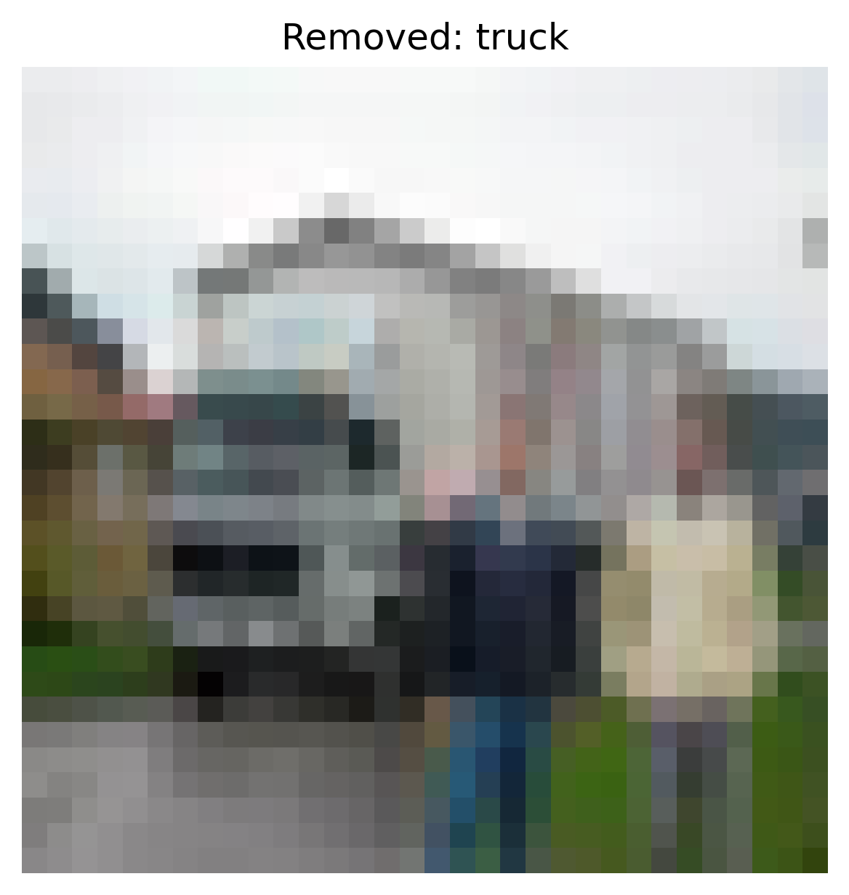

# Activation Clustering Report – Static Patch

## 1. Overview
- **Defense:** activation_clustering
- **Attack Type:** static_patch
- **Number of Removed Samples:** 10562
- **Defense Parameters:**
  - `num_clusters`: 2

## 2. Accuracy After Defense
- **Clean Test Set Accuracy:** `0.6154`
- **ASR After Defense:** `0.0009`

### Per-Class Accuracy (Clean)
- **airplane**: `0.7490`
- **automobile**: `0.7730`
- **bird**: `0.5740`
- **cat**: `0.4960`
- **deer**: `0.6560`
- **dog**: `0.5800`
- **frog**: `0.7820`
- **horse**: `0.0330`
- **ship**: `0.7690`
- **truck**: `0.7420`

### Per-Original-Class ASR
- **Original Class airplane**: `0.0010`
- **Original Class automobile**: `0.0000`
- **Original Class bird**: `0.0020`
- **Original Class cat**: `0.0040`
- **Original Class deer**: `0.0010`
- **Original Class dog**: `0.0000`
- **Original Class frog**: `0.0000`
- **Original Class ship**: `0.0000`
- **Original Class truck**: `0.0000`
## 3. Removed Sample Examples (Cluster-based)

**Removed Sample — Class: bird**

**Removed Sample — Class: horse**

**Removed Sample — Class: horse**

**Removed Sample — Class: truck**

**Removed Sample — Class: truck**

