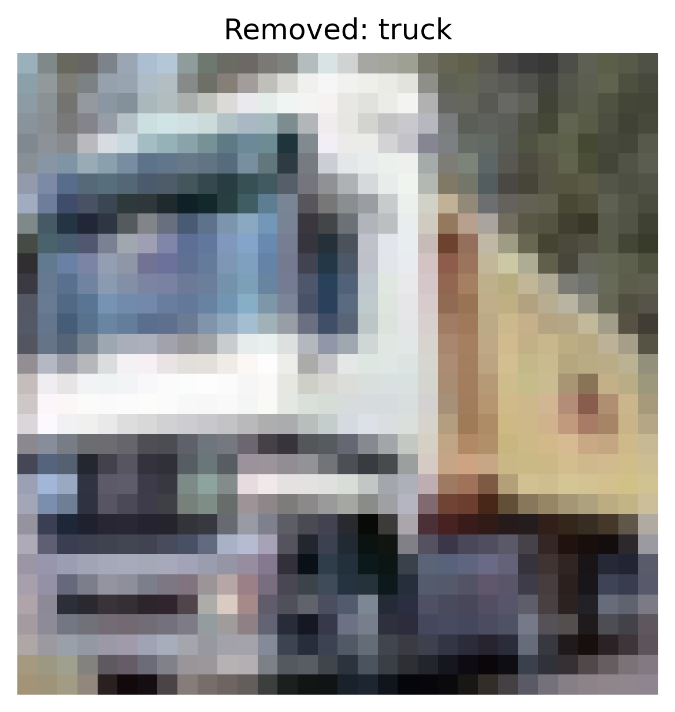

# Activation Clustering Report – Static Patch

## 1. Overview
- **Defense:** activation_clustering
- **Attack Type:** static_patch
- **Number of Removed Samples:** 17196
- **Defense Parameters:**
  - `num_clusters`: 2

## 2. Accuracy After Defense
- **Overall Accuracy:** `0.4461`

### Per-Class Accuracy
- **airplane**: `0.7300`
- **automobile**: `0.0030`
- **bird**: `0.4040`
- **cat**: `0.6140`
- **deer**: `0.5320`
- **dog**: `0.6910`
- **frog**: `0.5790`
- **horse**: `0.6430`
- **ship**: `0.2650`
- **truck**: `0.0000`

## 3. Removed Sample Examples (Cluster-based)

**Removed Sample — Class: frog**

**Removed Sample — Class: truck**

**Removed Sample — Class: deer**

**Removed Sample — Class: automobile**

**Removed Sample — Class: bird**

