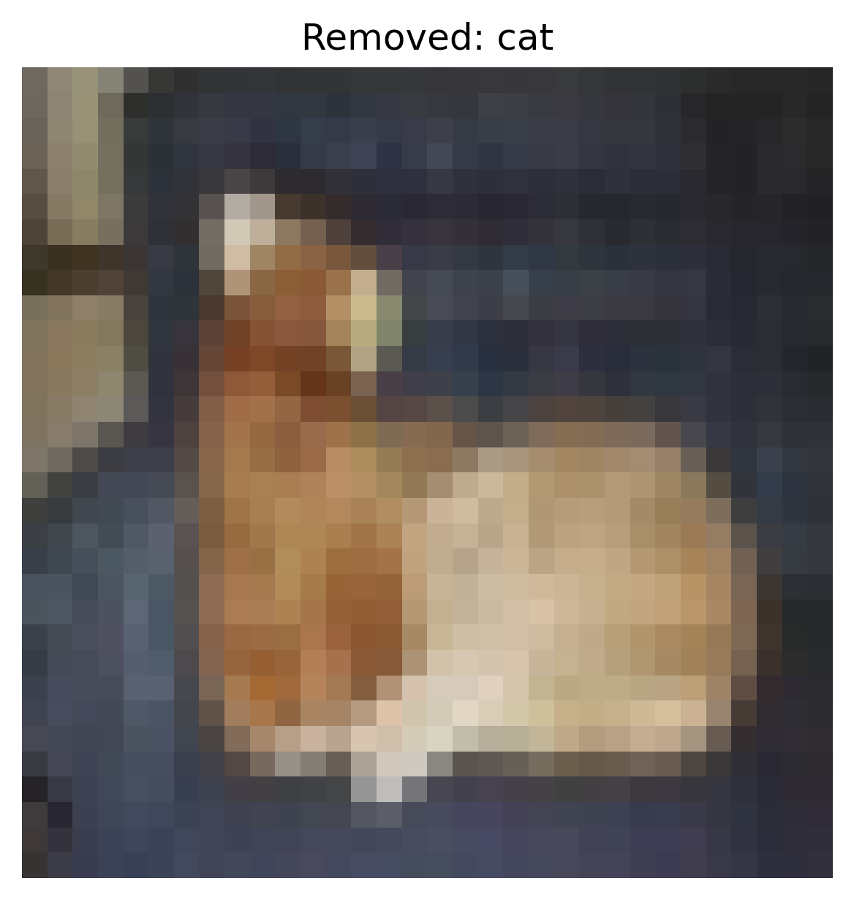

# Activation Clustering Report – Static Patch

## 1. Overview
- **Defense:** activation_clustering
- **Attack Type:** static_patch
- **Number of Removed Samples:** 16388
- **Defense Parameters:**
  - `num_clusters`: 2

## 2. Accuracy After Defense
- **Clean Test Set Accuracy:** `0.4356`
- **Adversarial Test Set Accuracy:** `0.1232`

### Per-Class Accuracy (Clean)
- **airplane**: `0.5660`
- **automobile**: `0.0090`
- **bird**: `0.2350`
- **cat**: `0.5120`
- **deer**: `0.6090`
- **dog**: `0.5760`
- **frog**: `0.8550`
- **horse**: `0.7860`
- **ship**: `0.1570`
- **truck**: `0.0510`

### Per-Class Accuracy (Adversarial)
- **airplane**: `0.0710`
- **automobile**: `0.0010`
- **bird**: `0.0150`
- **cat**: `0.9850`
- **deer**: `0.0120`
- **dog**: `0.0200`
- **frog**: `0.0600`
- **horse**: `0.0650`
- **ship**: `0.0000`
- **truck**: `0.0030`

## 3. Removed Sample Examples (Cluster-based)

**Removed Sample — Class: frog**

**Removed Sample — Class: automobile**

**Removed Sample — Class: horse**

**Removed Sample — Class: horse**

**Removed Sample — Class: cat**

