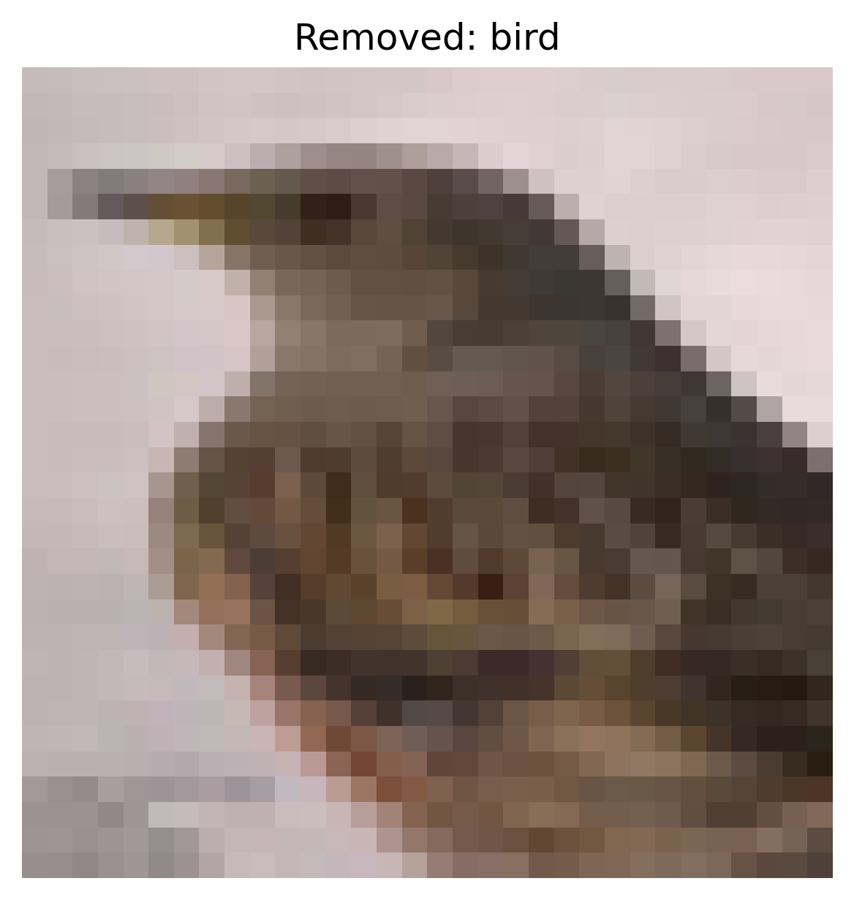
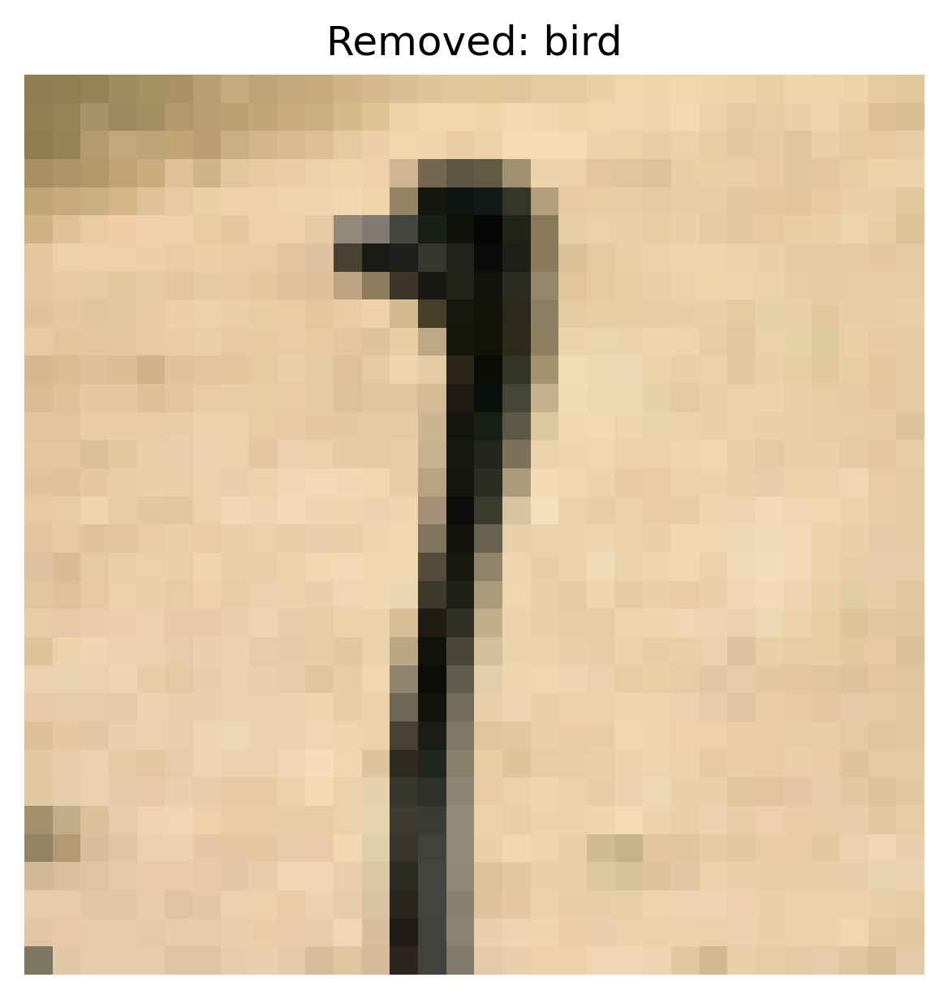
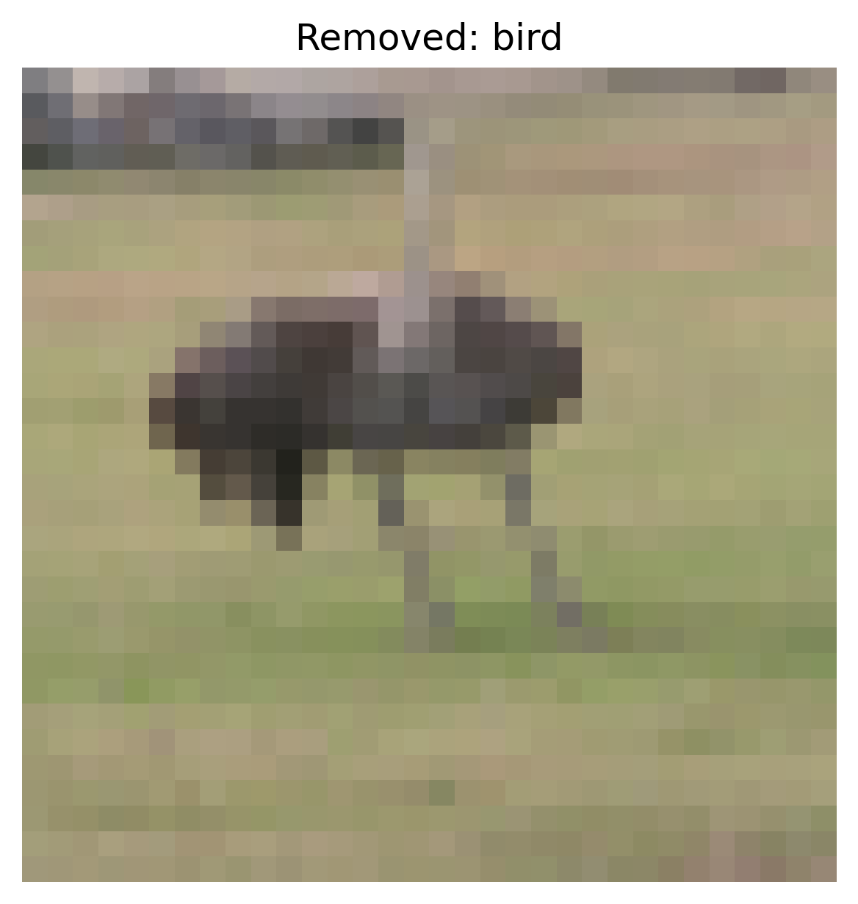

# Anomaly Detection Defense Report

**Attack Type:** static_patch
**Defense Method:** Anomaly Detection (isolation_forest)
**Number of Removed Samples:** 4500

## Accuracy After Defense

- **Overall Accuracy:** 0.6460

### Per-Class Accuracy
- **airplane**: 0.7600
- **automobile**: 0.6270
- **bird**: 0.4650
- **cat**: 0.6110
- **deer**: 0.6080
- **dog**: 0.5140
- **frog**: 0.7920
- **horse**: 0.5650
- **ship**: 0.8280
- **truck**: 0.6900

## Visual Examples of Removed Samples

The following are examples of samples removed by the anomaly detection method.

**Removed Sample — Label: truck**

**Removed Sample — Label: automobile**

**Removed Sample — Label: bird**

**Removed Sample — Label: bird**

**Removed Sample — Label: bird**

