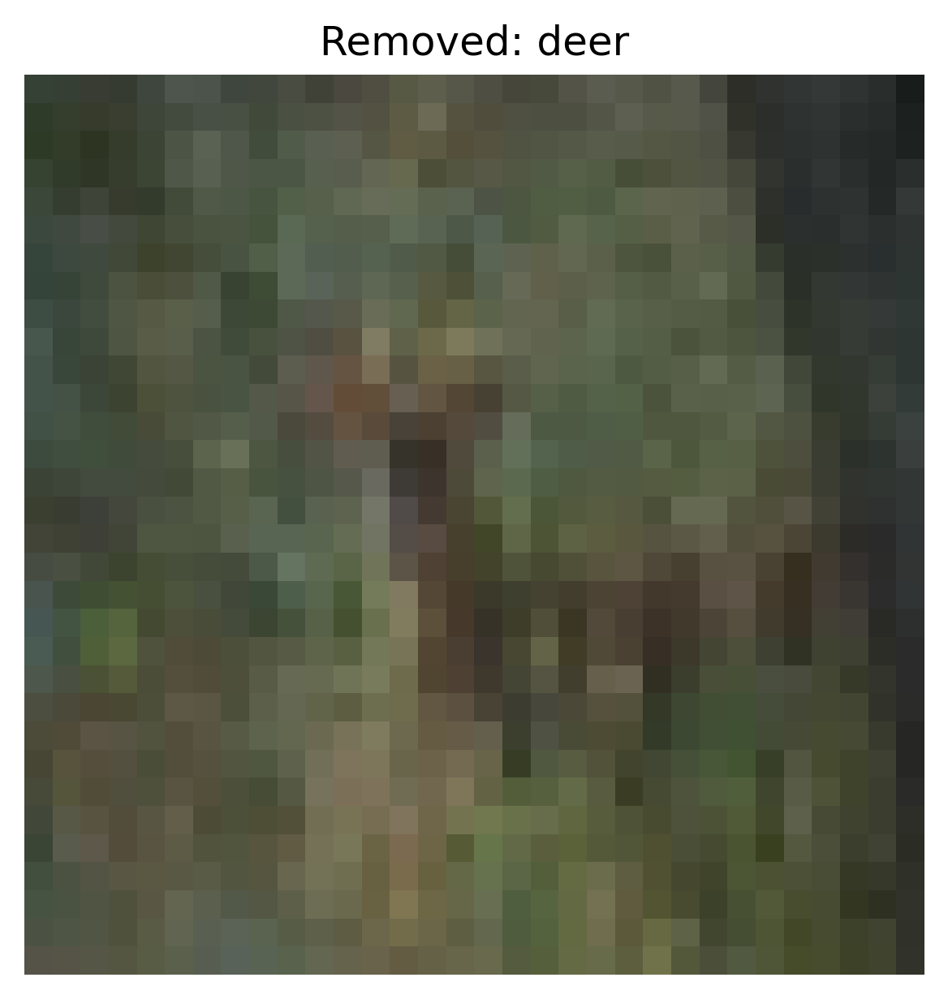

# Anomaly Detection Defense Report

**Attack Type:** `static_patch`  
**Defense Method:** `anomaly_detection`  
**Clean Accuracy:** `0.6416`  
- **ASR After Defense:** `0.9204`

## Parameters

- **type**: `isolation_forest`

## Per-Class Accuracy (Clean)

- **airplane**: `0.6890`
- **automobile**: `0.8560`
- **bird**: `0.5070`
- **cat**: `0.3420`
- **deer**: `0.6880`
- **dog**: `0.4330`
- **frog**: `0.6280`
- **horse**: `0.8160`
- **ship**: `0.7880`
- **truck**: `0.6690`

### Per-Original-Class ASR
- **Original Class airplane**: `0.8670`
- **Original Class automobile**: `0.8400`
- **Original Class bird**: `0.9500`
- **Original Class cat**: `0.9370`
- **Original Class deer**: `0.9790`
- **Original Class dog**: `0.9650`
- **Original Class frog**: `0.9200`
- **Original Class ship**: `0.9570`
- **Original Class truck**: `0.8690`

## Removed Samples

**Number of removed samples:** `4500`

### Examples

- `truck`: 
- `deer`: 
- `bird`: 
- `truck`: 
- `bird`: 