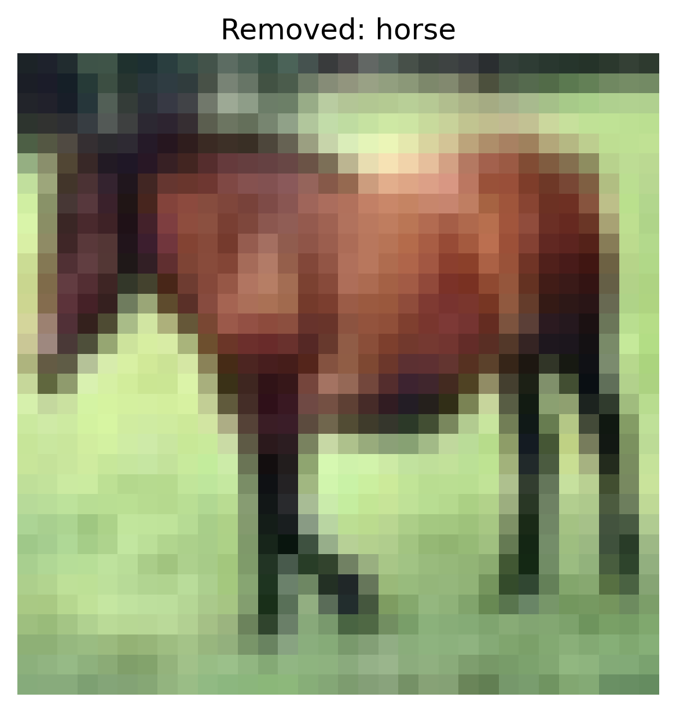

# Anomaly Detection Defense Report

**Attack Type:** `static_patch`  
**Defense Method:** `anomaly_detection`  
**Clean Accuracy:** `0.6618`  
**Adversarial Accuracy:** `0.1976`  

## Parameters

- **type**: `isolation_forest`

## Per-Class Accuracy (Clean)

- **airplane**: `0.7430`
- **automobile**: `0.7920`
- **bird**: `0.5310`
- **cat**: `0.5410`
- **deer**: `0.6070`
- **dog**: `0.5320`
- **frog**: `0.8710`
- **horse**: `0.6270`
- **ship**: `0.7310`
- **truck**: `0.6430`

## Per-Class Accuracy (Adversarial)

- **airplane**: `0.1640`
- **automobile**: `0.1610`
- **bird**: `0.0850`
- **cat**: `0.9710`
- **deer**: `0.0450`
- **dog**: `0.0300`
- **frog**: `0.1880`
- **horse**: `0.1020`
- **ship**: `0.0500`
- **truck**: `0.1800`

## Removed Samples

**Number of removed samples:** `4500`

### Examples

- `horse`: 
- `bird`: 
- `frog`: 
- `dog`: 
- `horse`: 