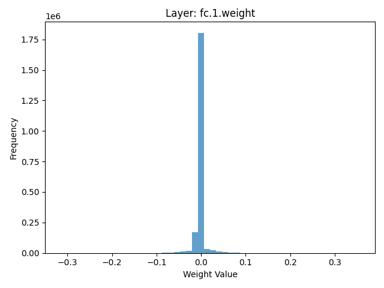
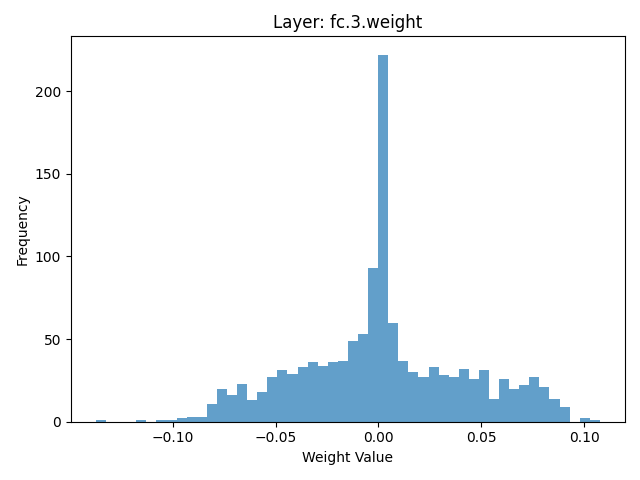

# Model Inspection Defense Report

**Attack Type:** static_patch
**Defense Method:** Model Inspection
**Inspected Layers:** conv.0.weight, conv.0.bias, fc.1.weight, fc.1.bias
**Suspicious Layers Detected:** 0

## Clean Accuracy After Defense

- **Overall Accuracy:** 0.6440

### Per-Class Accuracy (Clean)
- **airplane**: 0.6020
- **automobile**: 0.7410
- **bird**: 0.7260
- **cat**: 0.3740
- **deer**: 0.4280
- **dog**: 0.6410
- **frog**: 0.7760
- **horse**: 0.6460
- **ship**: 0.7660
- **truck**: 0.7400
- **ASR After Defense:** `0.9153`

### Per-Original-Class ASR
- **Original Class airplane**: `0.8710`
- **Original Class automobile**: `0.8720`
- **Original Class bird**: `0.9290`
- **Original Class cat**: `0.9040`
- **Original Class deer**: `0.9840`
- **Original Class dog**: `0.9250`
- **Original Class frog**: `0.8820`
- **Original Class ship**: `0.9740`
- **Original Class truck**: `0.8970`

## Weight Histograms
The following histograms visualize the weight distributions of the inspected layers.

### conv 0 bias hist

### conv 0 weight hist

### fc 1 bias hist

### fc 1 weight hist

### fc 3 bias hist

### fc 3 weight hist

