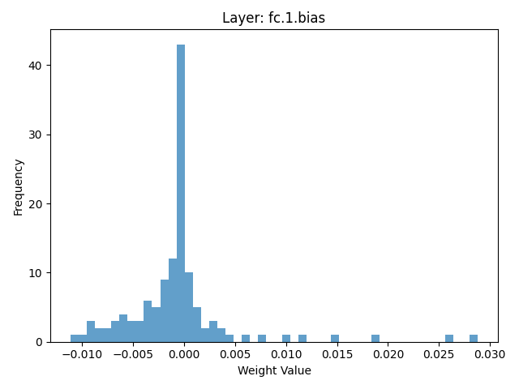

# Model Inspection Defense Report

**Attack Type:** static_patch
**Defense Method:** Model Inspection
**Inspected Layers:** fc.1, fc.3
**Suspicious Layers Detected:** 0

## Accuracy After Defense

- **Overall Accuracy:** 0.6276

### Per-Class Accuracy
- **airplane**: 0.8380
- **automobile**: 0.7650
- **bird**: 0.5190
- **cat**: 0.4650
- **deer**: 0.4790
- **dog**: 0.5830
- **frog**: 0.4500
- **horse**: 0.7780
- **ship**: 0.6470
- **truck**: 0.7520

## Weight Histograms
The following histograms visualize the weight distributions of the inspected layers.

### fc 1 bias hist

### fc 1 weight hist

### fc 3 bias hist

### fc 3 weight hist

