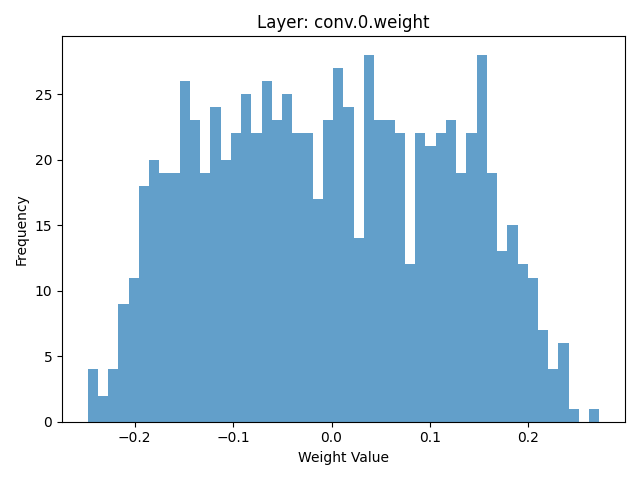

# Model Inspection Defense Report

**Attack Type:** static_patch
**Defense Method:** Model Inspection
**Inspected Layers:** conv.0.weight, conv.0.bias, fc.1.weight, fc.1.bias
**Suspicious Layers Detected:** 0

## Clean Accuracy After Defense

- **Overall Accuracy:** 0.6275

### Per-Class Accuracy (Clean)
- **airplane**: 0.7780
- **automobile**: 0.8560
- **bird**: 0.2810
- **cat**: 0.4590
- **deer**: 0.7450
- **dog**: 0.4350
- **frog**: 0.8090
- **horse**: 0.5720
- **ship**: 0.5560
- **truck**: 0.7840

## Adversarial Accuracy After Defense
- **Overall Accuracy:** 0.1440

### Per-Class Accuracy (Adversarial)
- **airplane**: 0.0950
- **automobile**: 0.1300
- **bird**: 0.0140
- **cat**: 0.9900
- **deer**: 0.0010
- **dog**: 0.0070
- **frog**: 0.0850
- **horse**: 0.0130
- **ship**: 0.0060
- **truck**: 0.0990

## Weight Histograms
The following histograms visualize the weight distributions of the inspected layers.

### conv 0 bias hist

### conv 0 weight hist

### fc 1 bias hist

### fc 1 weight hist

### fc 3 bias hist

### fc 3 weight hist

