# Spectral Signatures Defense Report

**Attack Type:** static_patch
**Defense Method:** Spectral Signatures
**Threshold Used:** 0.9
**Number of Removed Samples:** 4503

## Accuracy After Defense

- **Overall Accuracy:** 0.5983

### Per-Class Accuracy
- **airplane**: 0.4740
- **automobile**: 0.7280
- **bird**: 0.5910
- **cat**: 0.5590
- **deer**: 0.4400
- **dog**: 0.6280
- **frog**: 0.7980
- **horse**: 0.5410
- **ship**: 0.6530
- **truck**: 0.5710

## Spectral Histograms

The following histograms illustrate the spectral signature magnitudes for each class.

### Class 0 hist
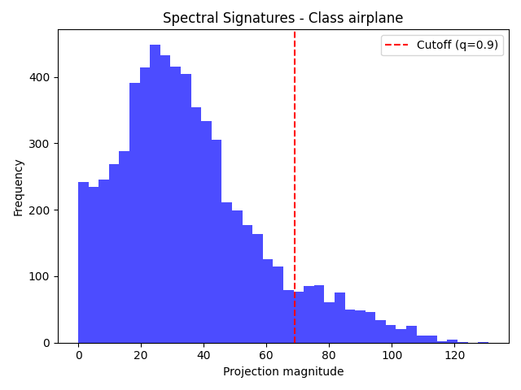

### Class 1 hist
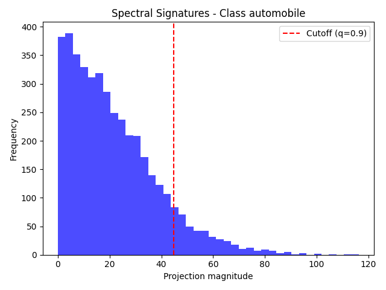

### Class 2 hist
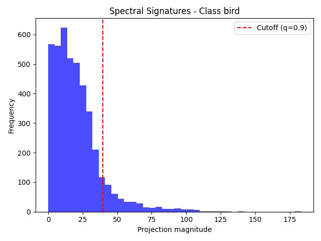

### Class 3 hist
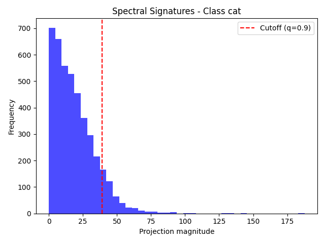

### Class 4 hist
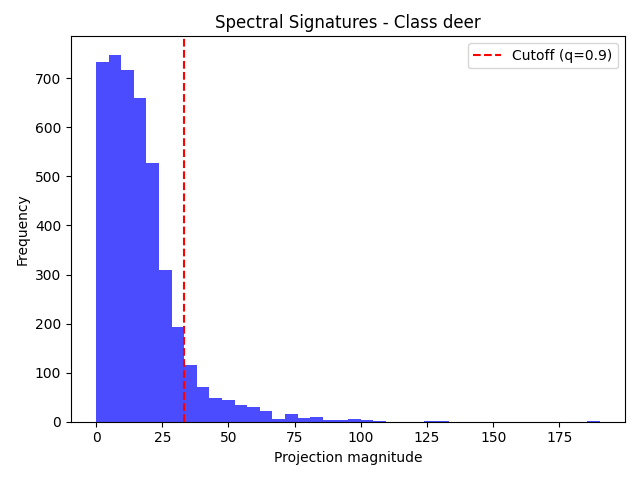

### Class 5 hist
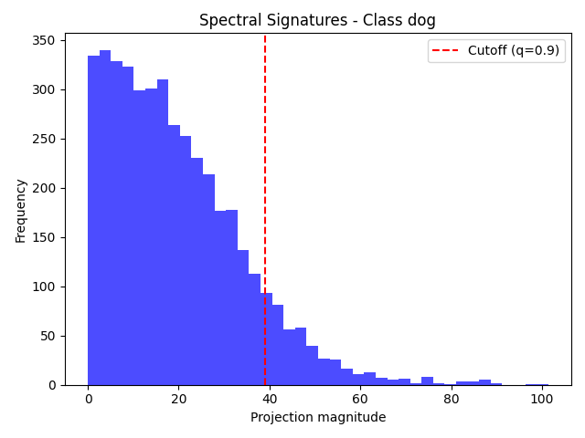

### Class 6 hist
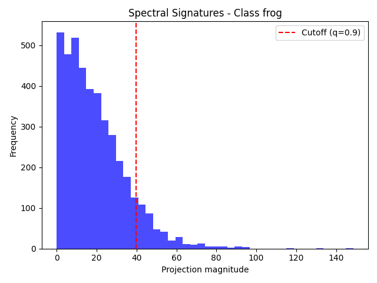

### Class 7 hist

### Class 8 hist
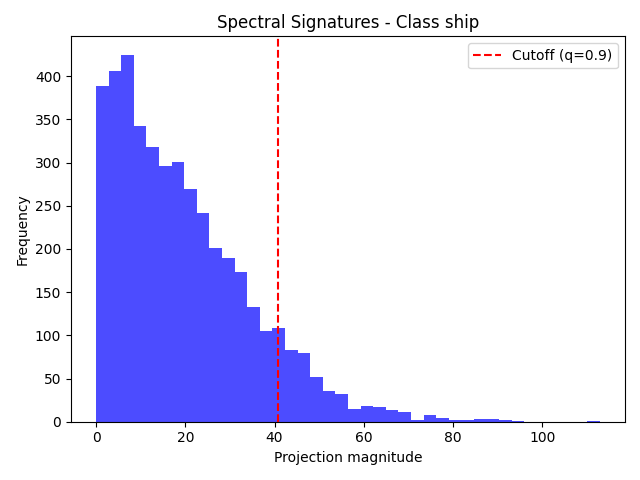

### Class 9 hist
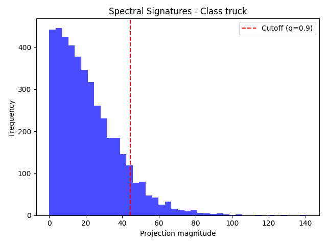

## Removed Examples

The following examples were identified as suspicious and removed from the training set.

**Label:** airplane — **Index:** 29
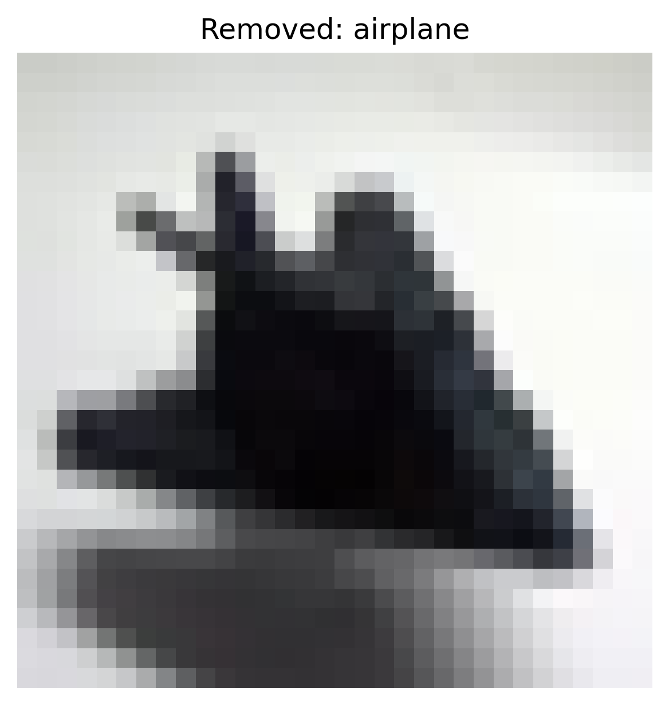

**Label:** truck — **Index:** 208
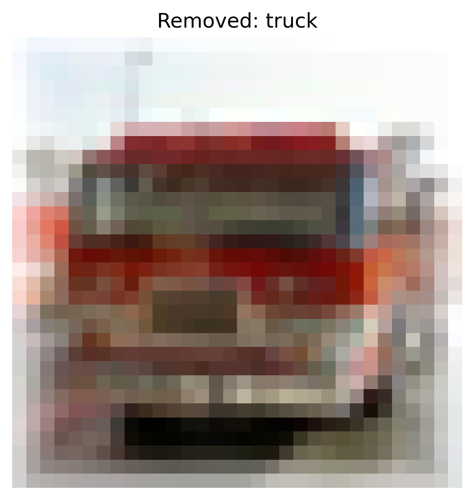

**Label:** airplane — **Index:** 215

**Label:** dog — **Index:** 297
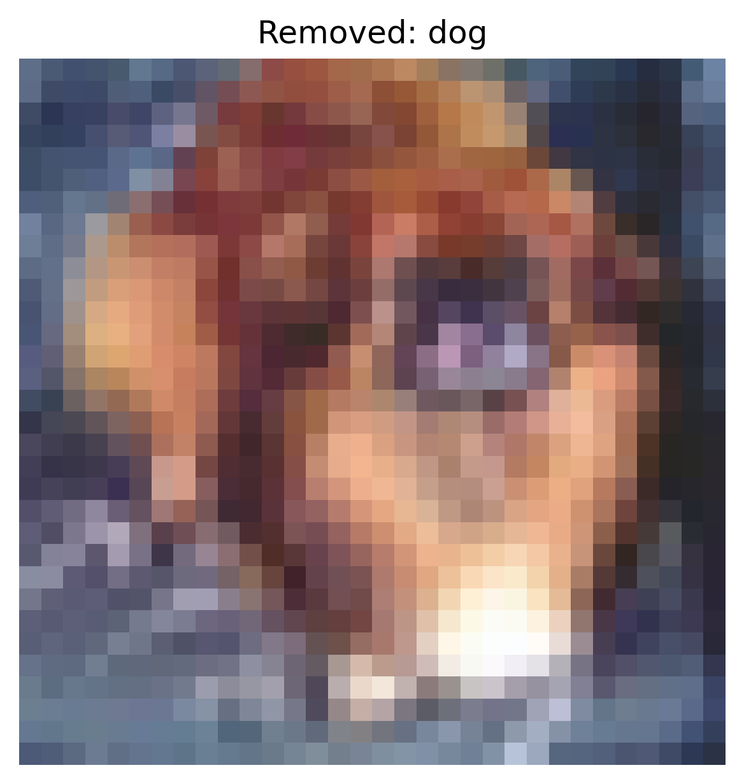

**Label:** truck — **Index:** 306
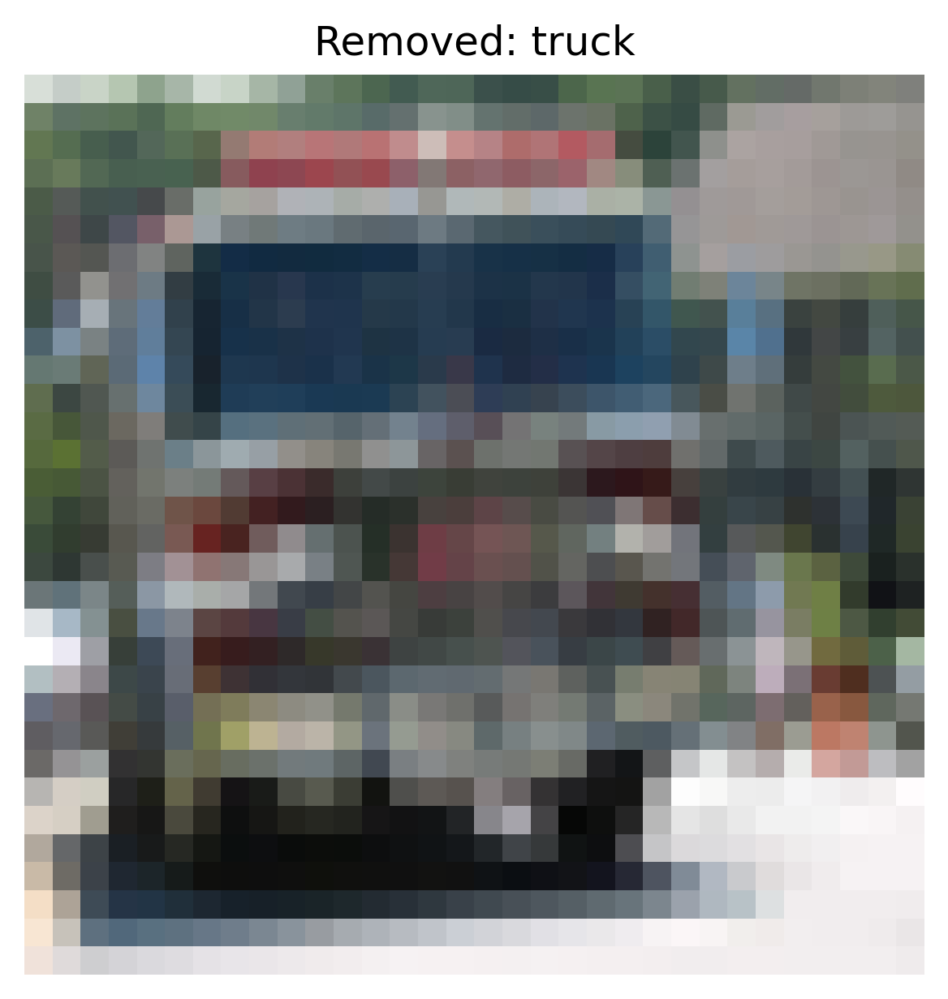
