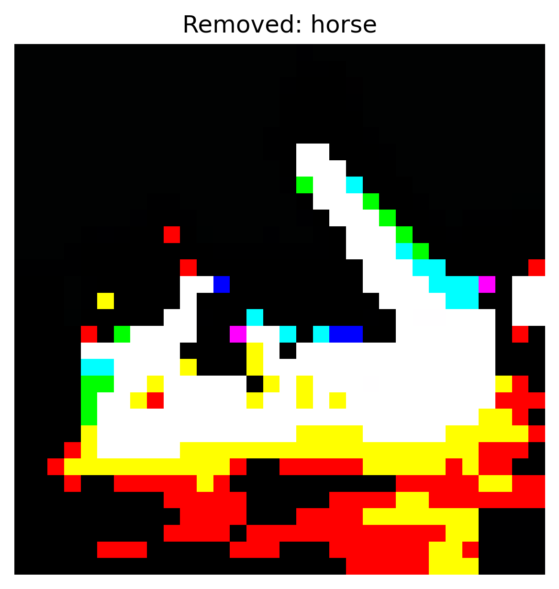
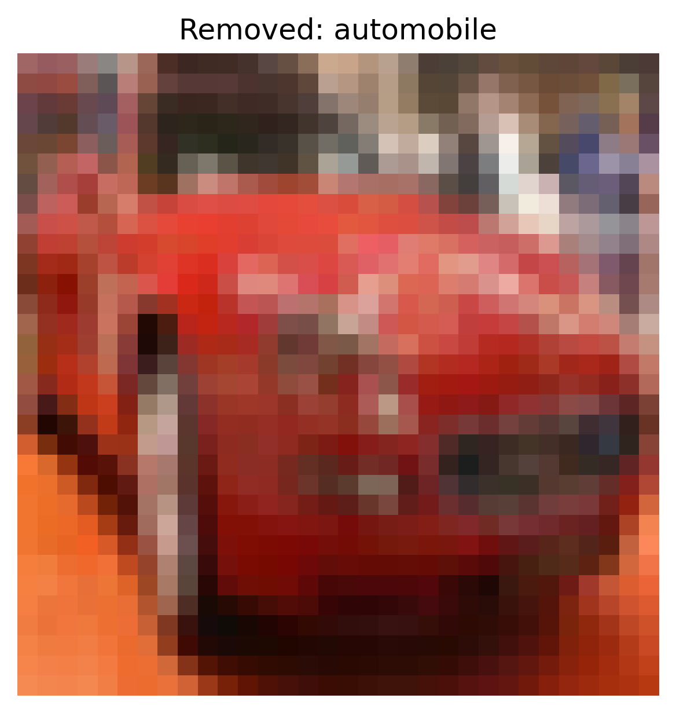
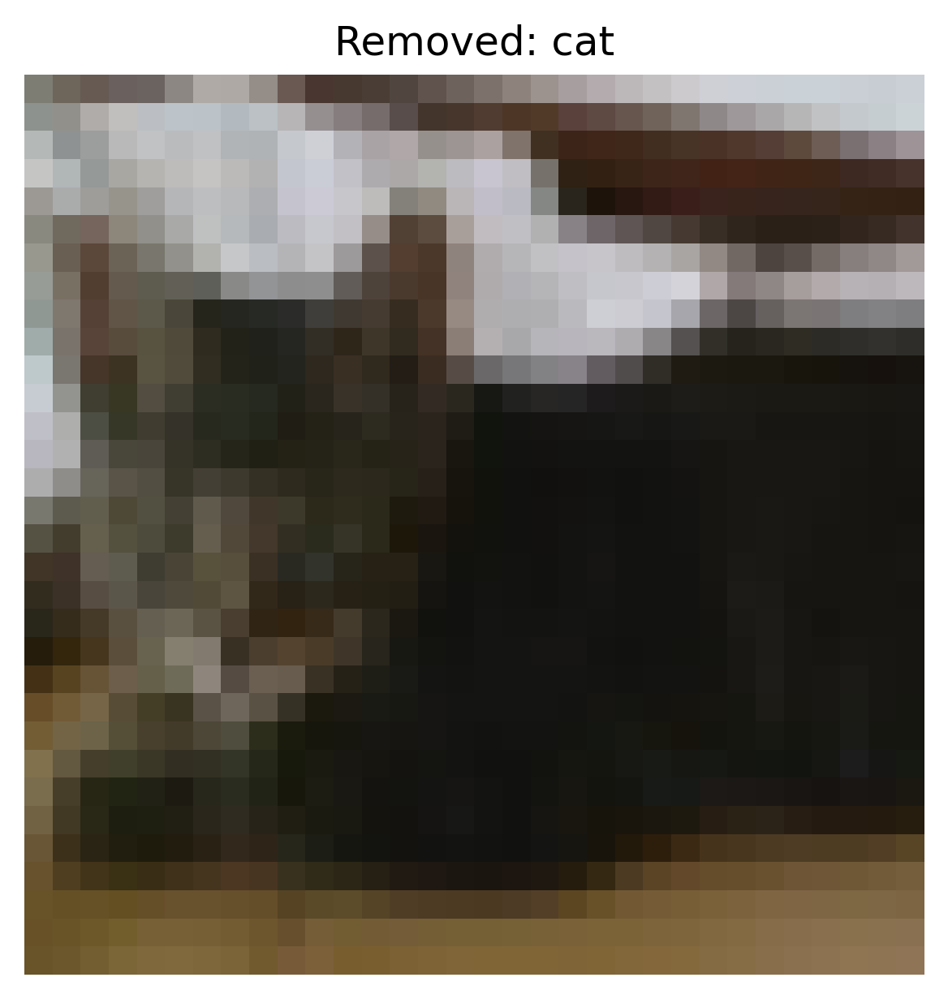
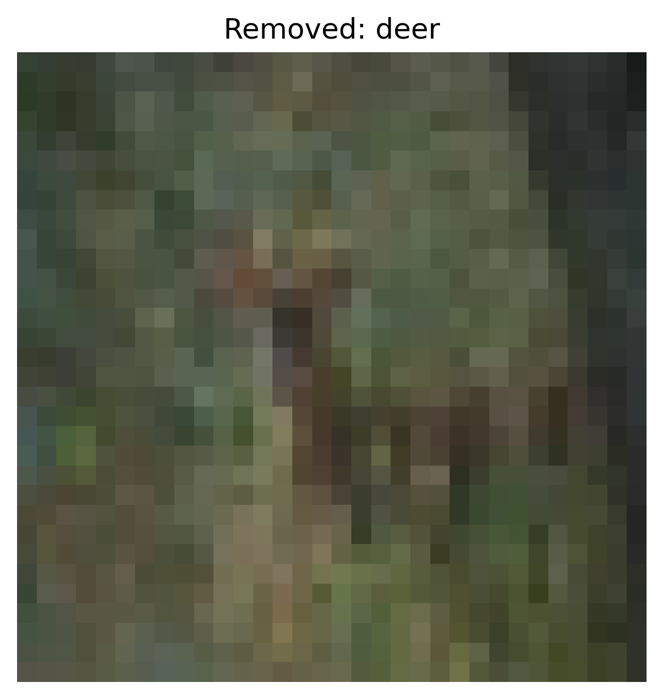
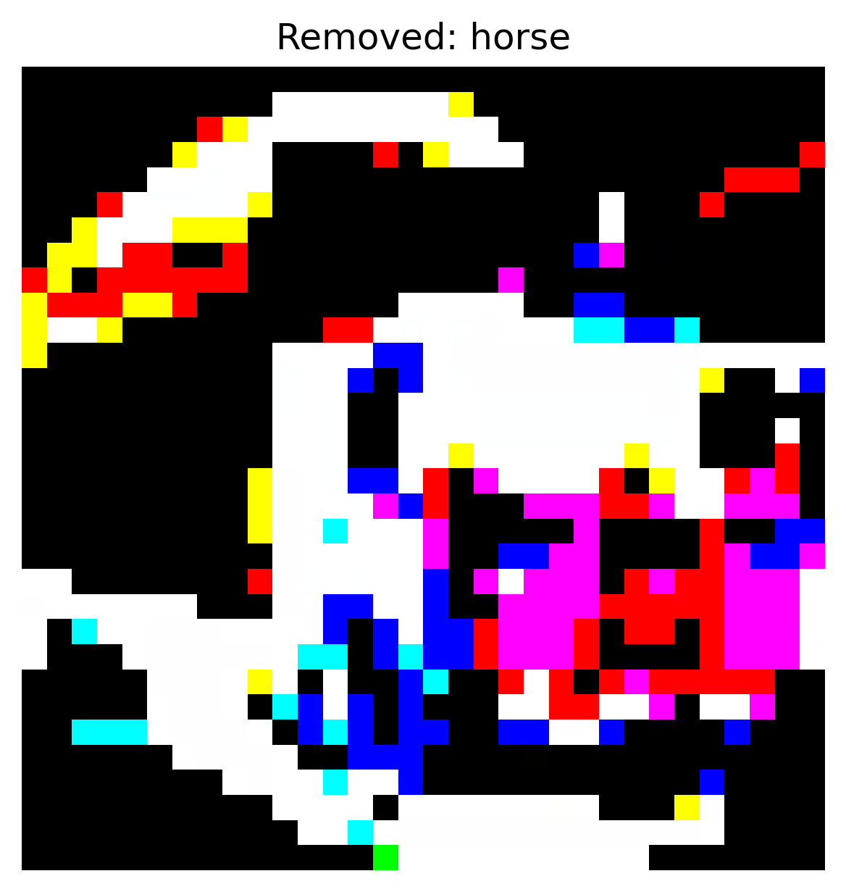

# Spectral Signatures Defense Report

**Attack Type:** static_patch

**Defense:** spectral_signatures

## Defense Parameters

- `threshold`: 0.9

## Accuracy After Defense

- **Clean Accuracy:** 0.5158
- **ASR After Defense:** `0.0376`

## Per-Class Accuracy (Clean)

- airplane: 0.7810
- automobile: 0.2820
- bird: 0.5350
- cat: 0.5450
- deer: 0.6210
- dog: 0.4730
- frog: 0.8050
- horse: 0.4840
- ship: 0.2710
- truck: 0.3610

### Per-Original-Class ASR
- **Original Class airplane**: `0.0250`
- **Original Class automobile**: `0.0670`
- **Original Class bird**: `0.0280`
- **Original Class cat**: `0.0300`
- **Original Class deer**: `0.0310`
- **Original Class dog**: `0.0380`
- **Original Class frog**: `0.0090`
- **Original Class ship**: `0.0200`
- **Original Class truck**: `0.0900`

## Removed Samples Summary

- **Total Removed:** 19529

## Spectral Signature Histogram

## Examples of Removed Samples

- **Index**: 2, **Label**: horse

  

- **Index**: 5, **Label**: automobile

  

- **Index**: 9, **Label**: cat

  

- **Index**: 10, **Label**: deer

  

- **Index**: 14, **Label**: horse

  
