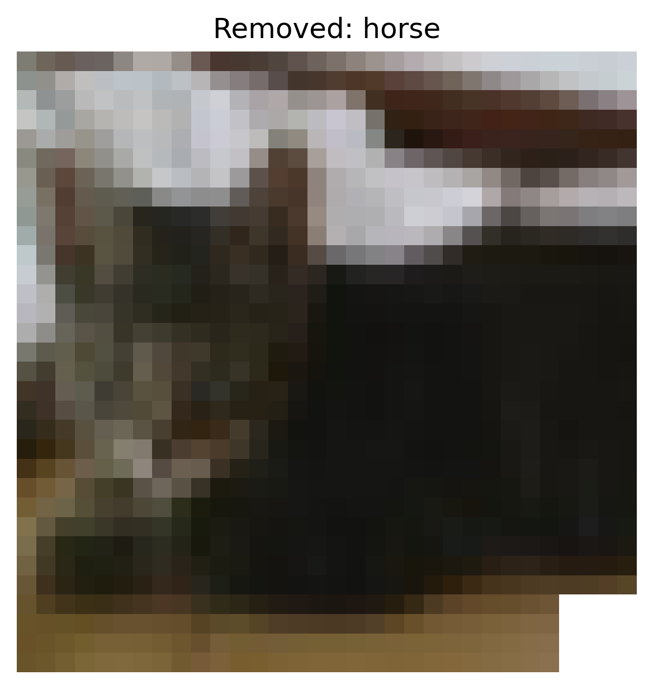

# Spectral Signatures Defense Report

**Attack Type:** static_patch

**Defense:** spectral_signatures

## Defense Parameters

- `threshold`: 0.9

## Accuracy After Defense

- **Clean Accuracy:** 0.5057
- **ASR After Defense:** `0.8573`

## Per-Class Accuracy (Clean)

- airplane: 0.7280
- automobile: 0.3180
- bird: 0.2380
- cat: 0.3820
- deer: 0.5960
- dog: 0.8120
- frog: 0.5430
- horse: 0.6230
- ship: 0.4710
- truck: 0.3460

### Per-Original-Class ASR
- **Original Class airplane**: `0.7770`
- **Original Class automobile**: `0.8590`
- **Original Class bird**: `0.8900`
- **Original Class cat**: `0.7920`
- **Original Class deer**: `0.9460`
- **Original Class dog**: `0.8000`
- **Original Class frog**: `0.8160`
- **Original Class ship**: `0.9410`
- **Original Class truck**: `0.8950`

## Removed Samples Summary

- **Total Removed:** 19327

## Spectral Signature Histogram

## Examples of Removed Samples

- **Index**: 1, **Label**: truck

  

- **Index**: 2, **Label**: truck

  

- **Index**: 4, **Label**: automobile

  

- **Index**: 7, **Label**: horse

  

- **Index**: 9, **Label**: horse

  
