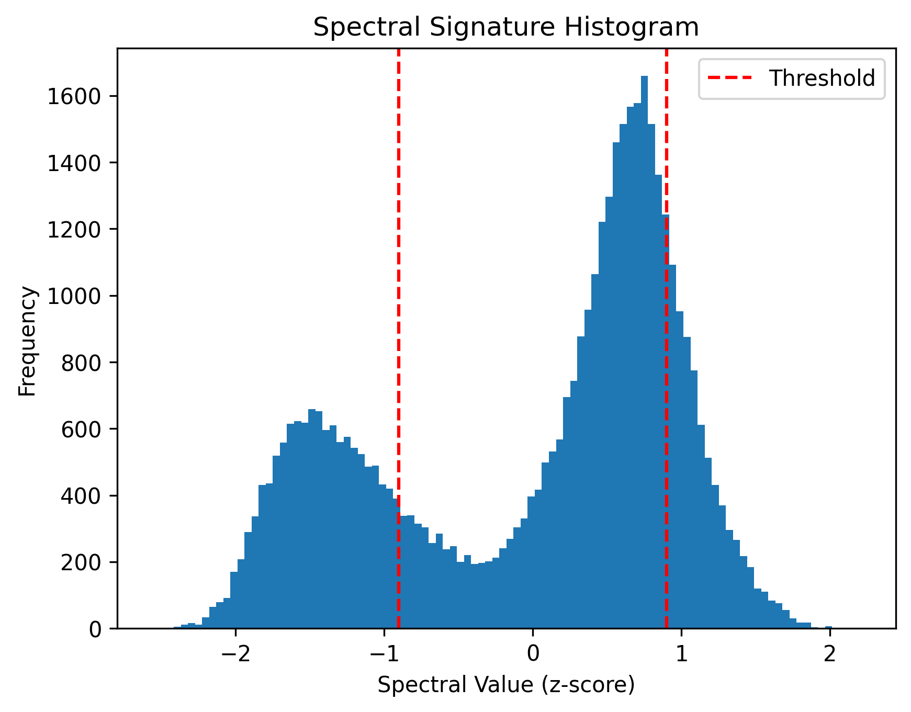

# Spectral Signatures Defense Report

**Attack Type:** static_patch

**Defense:** spectral_signatures

## Defense Parameters

- `threshold`: 0.9

## Accuracy After Defense

- **Clean Accuracy:** 0.5565
- **Adversarial Accuracy:** 0.1704

## Per-Class Accuracy (Clean)

- airplane: 0.7670
- automobile: 0.2340
- bird: 0.4910
- cat: 0.2780
- deer: 0.7400
- dog: 0.3500
- frog: 0.6050
- horse: 0.7640
- ship: 0.7170
- truck: 0.6190

## Per-Class Accuracy (Adversarial)

- airplane: 0.1780
- automobile: 0.0200
- bird: 0.0650
- cat: 0.9660
- deer: 0.0510
- dog: 0.0240
- frog: 0.0770
- horse: 0.0930
- ship: 0.1040
- truck: 0.1260

## Removed Samples Summary

- **Total Removed:** 20877

## Spectral Signature Histogram

## Examples of Removed Samples

- **Index**: 0, **Label**: frog

  

- **Index**: 6, **Label**: bird

  

- **Index**: 7, **Label**: horse

  

- **Index**: 14, **Label**: truck

  

- **Index**: 16, **Label**: truck

  
