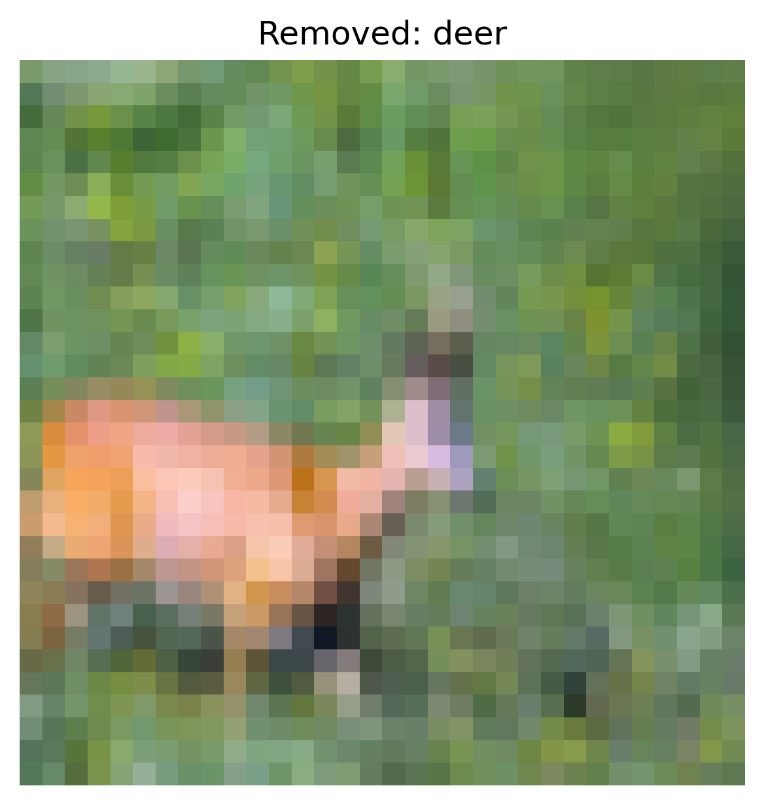

# Defense Report — Influence Functions

## Overview

- **Defense:** influence_functions
- **Attack Targeted:** clean_label
- **Influence Method:** grad_influence
- **Sample Size:** 500

## Performance Metrics

- **Accuracy After Defense:** 0.6550

### Per‑Class Accuracy

| Class | Accuracy |
|-------|----------|
| airplane | 0.7410 |
| automobile | 0.7510 |
| bird | 0.3680 |
| cat | 0.6790 |
| deer | 0.4780 |
| dog | 0.5670 |
| frog | 0.7690 |
| horse | 0.6210 |
| ship | 0.8250 |
| truck | 0.7510 |

## Cleaning Summary

- **Total Samples Removed:** 1881

## Example Removed Samples

The following examples illustrate removed samples identified as influential outliers.

Each image is named using the format:


```
removed_<index>_<label>.png
```
- `<index>`: Sample index in the dataset.
- `<label>`: Original class label.

<div style="display: flex; gap: 10px; flex-wrap: wrap;">
<div style="text-align:center;"><small>influence_examples/removed_49_0.png</small><br></div>
<div style="text-align:center;"><small>influence_examples/removed_72_6.png</small><br></div>
<div style="text-align:center;"><small>influence_examples/removed_82_4.png</small><br></div>
<div style="text-align:center;"><small>influence_examples/removed_139_8.png</small><br></div>
<div style="text-align:center;"><small>influence_examples/removed_152_7.png</small><br></div>
</div>