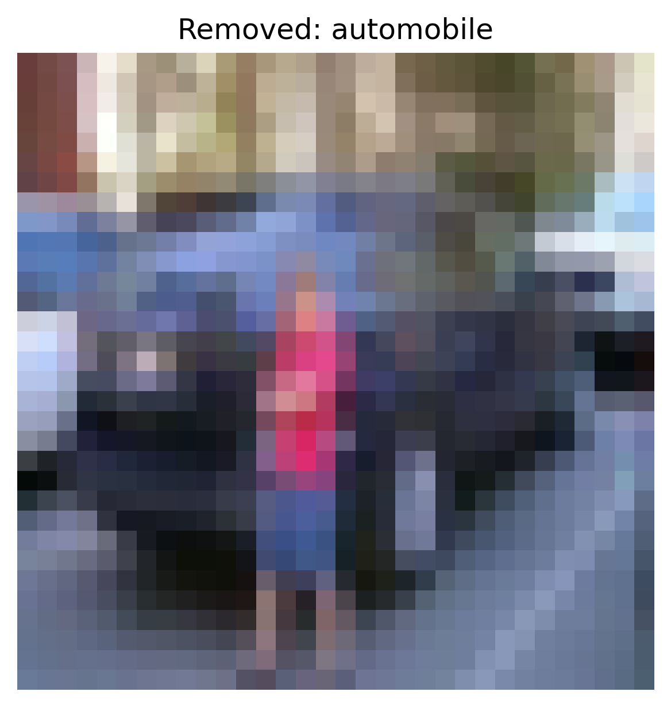
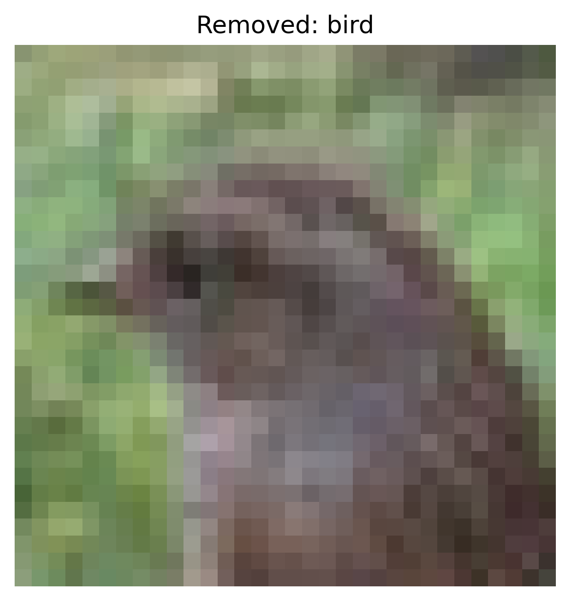
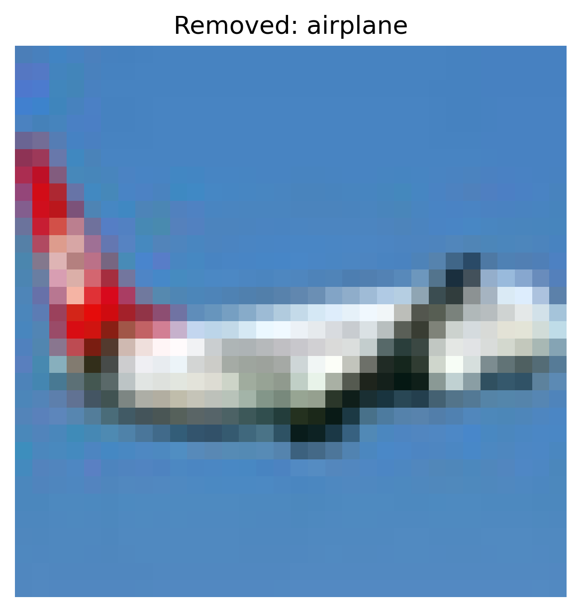
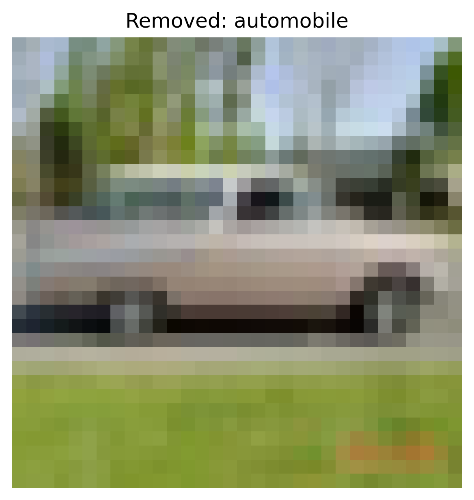
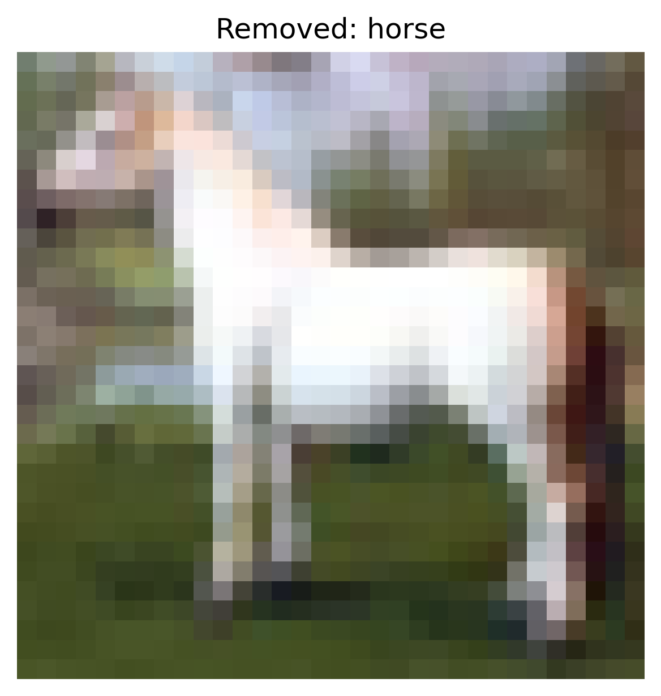

# Provenance Tracking Defense Report

**Attack type:** `clean_label`  
**Granularity:** `batch`  
**Number of removed samples:** 1544  
**Clean test accuracy after defense:** **0.6544**  

## Accuracy Metrics

*Overall clean accuracy:* **0.6544**

### Per-Class Accuracy
| Class | Accuracy |
|:------|:--------:|
| airplane | 0.6210 |
| automobile | 0.8230 |
| bird | 0.5140 |
| cat | 0.3490 |
| deer | 0.4240 |
| dog | 0.5720 |
| frog | 0.8730 |
| horse | 0.8270 |
| ship | 0.7880 |
| truck | 0.7530 |

## Example Removed Samples

The following examples were flagged and removed during provenance tracking:

```
removed_<index>_<label>.png
```
- `<index>`: Sample index in the dataset.
- `<label>`: Original class label.

<div style="display: flex; gap: 10px; flex-wrap: wrap;">
<div style="text-align:center;"><small>provenance_examples/removed_11910_1.png</small><br></div>
<div style="text-align:center;"><small>provenance_examples/removed_25591_2.png</small><br></div>
<div style="text-align:center;"><small>provenance_examples/removed_468_0.png</small><br></div>
<div style="text-align:center;"><small>provenance_examples/removed_7087_1.png</small><br></div>
<div style="text-align:center;"><small>provenance_examples/removed_31432_7.png</small><br></div>
</div>
