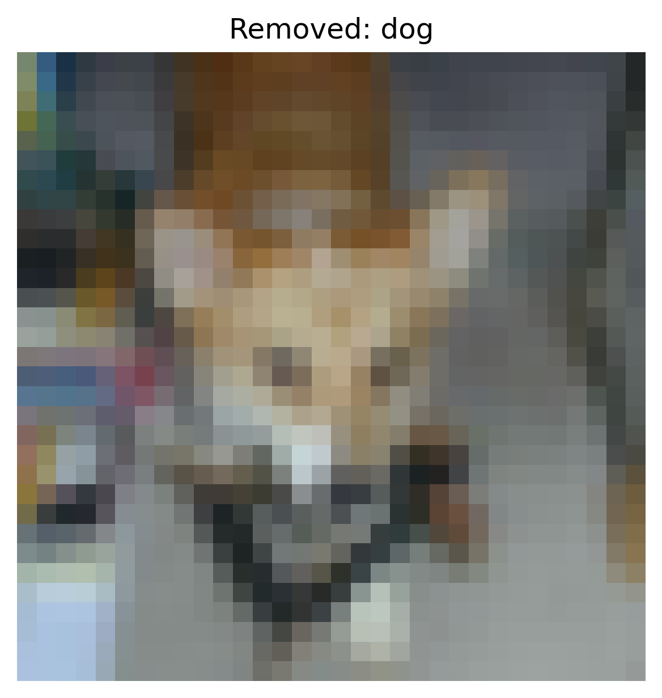
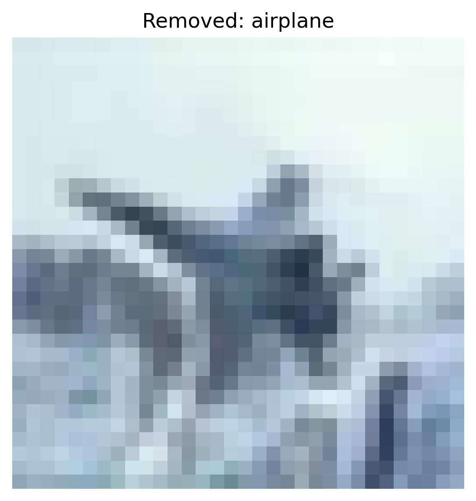
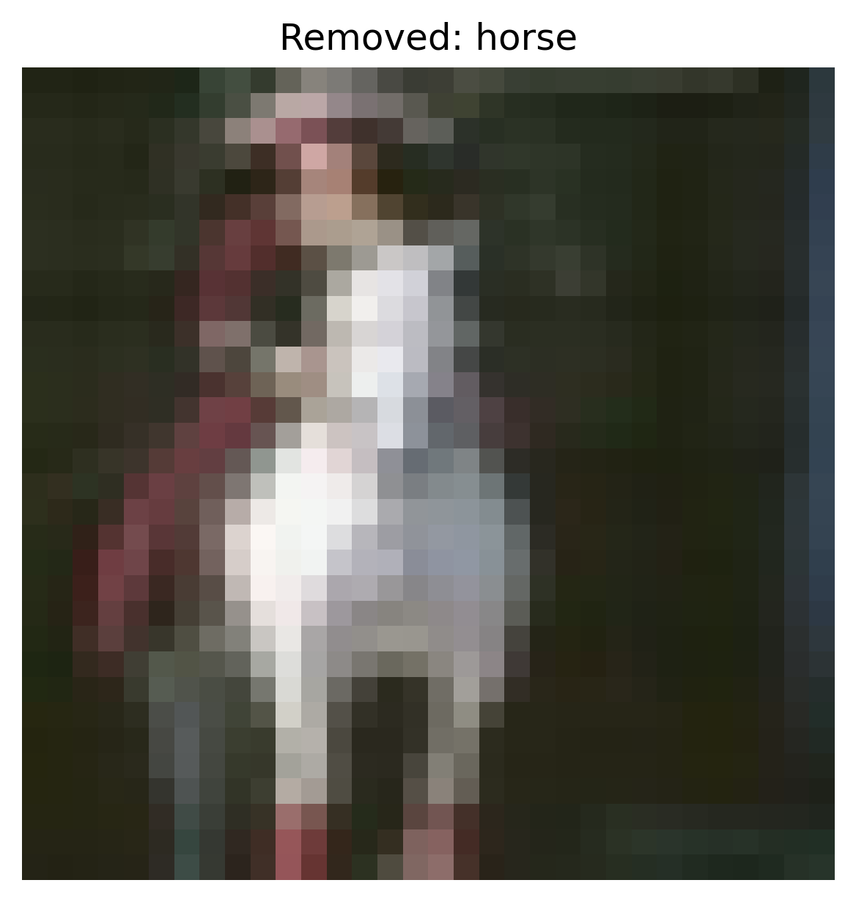
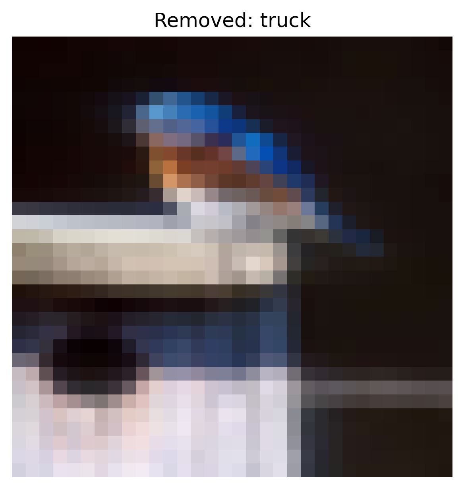

# Defense Report — Data Cleaning

## Overview

- **Defense:** data_cleaning
- **Attack Targeted:** label_flipping
- **Cleaning Method:** loss_filtering
- **Threshold:** 0.9

## Performance Metrics

- **Accuracy After Defense:** 0.6836

### Per‑Class Accuracy

| Class | Accuracy |
|-------|----------|
| airplane | 0.7810 |
| automobile | 0.7050 |
| bird | 0.5930 |
| cat | 0.4640 |
| deer | 0.6600 |
| dog | 0.6200 |
| frog | 0.7740 |
| horse | 0.6890 |
| ship | 0.8340 |
| truck | 0.7160 |

## Cleaning Summary

- **Total Samples Removed:** 6967

## Example Removed Samples

The following examples illustrate removed samples identified as outliers or noisy instances.
Each image is named using the format:

```
removed_<index>_<label>.png
```
- `<index>`: Sample index in the dataset.
- `<label>`: Original class label.

<div style="display: flex; gap: 10px; flex-wrap: wrap;">
<div style="text-align:center;"><small>cleaned_examples/removed_32769_5.png</small><br></div>
<div style="text-align:center;"><small>cleaned_examples/removed_6_2.png</small><br></div>
<div style="text-align:center;"><small>cleaned_examples/removed_32775_0.png</small><br></div>
<div style="text-align:center;"><small>cleaned_examples/removed_32779_7.png</small><br></div>
<div style="text-align:center;"><small>cleaned_examples/removed_13_9.png</small><br></div>
</div>