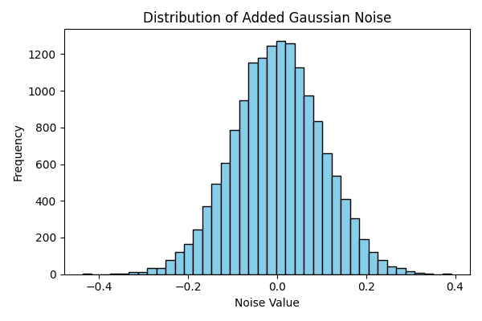
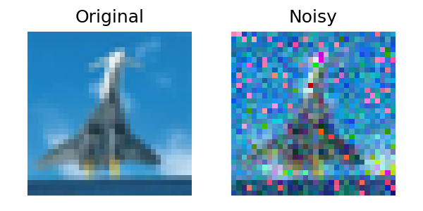
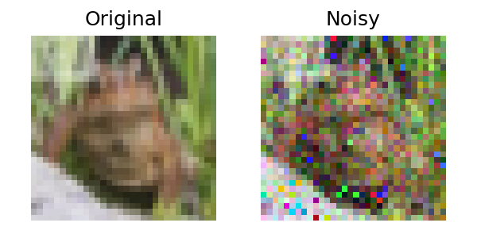
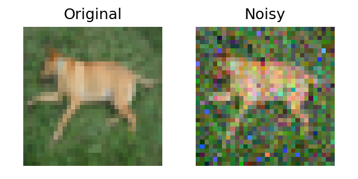
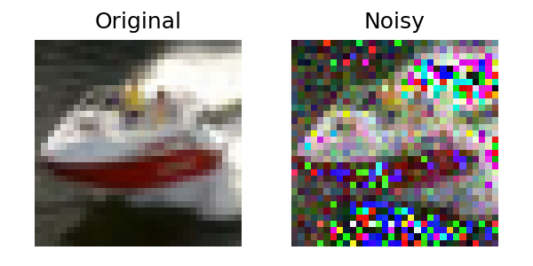
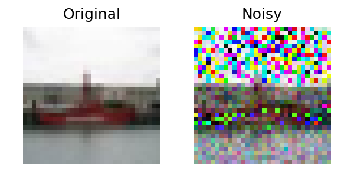

# Randomized Smoothing Defense Report

**Attack Type:** pgd
**Defense Method:** Randomized Smoothing
**Noise Level (σ):** 0.1

## Accuracy After Defense

- **Overall Accuracy:** 0.5332

### Per-Class Accuracy
- **airplane**: 0.7880
- **automobile**: 0.4380
- **bird**: 0.5930
- **cat**: 0.1670
- **deer**: 0.2500
- **dog**: 0.7690
- **frog**: 0.2840
- **horse**: 0.5440
- **ship**: 0.7900
- **truck**: 0.7090

## Noise Distribution
The histogram below shows the distribution of the Gaussian noise applied during training.

## Visual Examples
Each example below compares the original and noisy version of a training sample.

### Example 0

### Example 1

### Example 2

### Example 3

### Example 4

